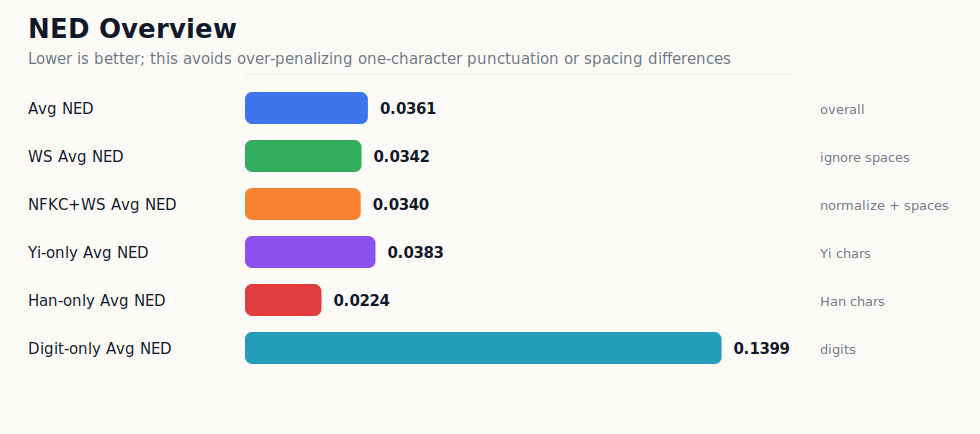
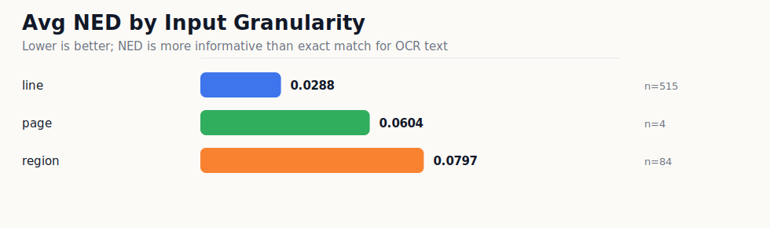
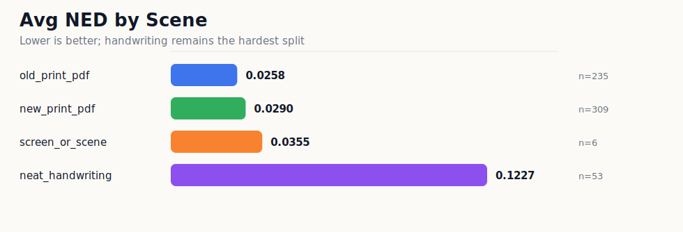
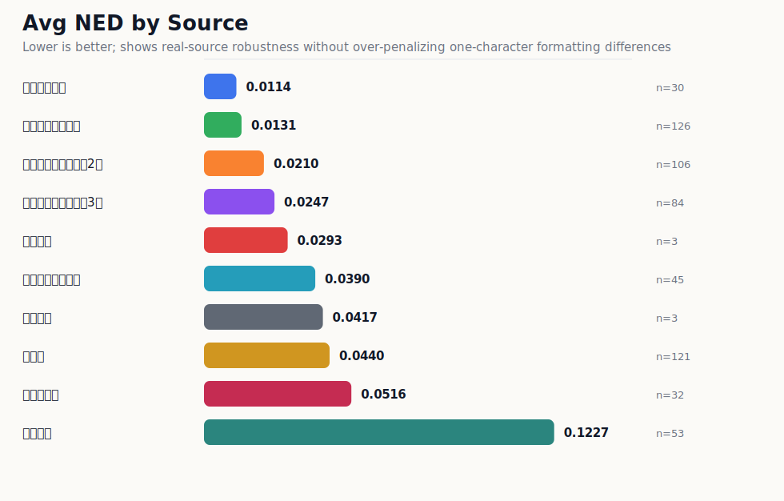
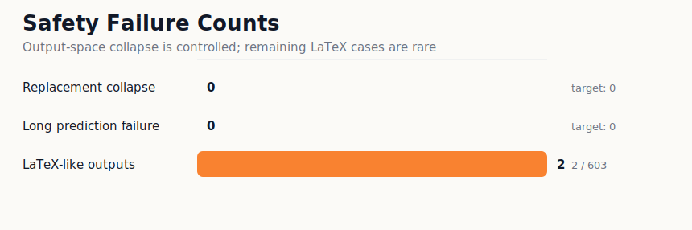

# NuosuBburma OCR Evaluation Set

本目录是 `NuosuBburma OCR` 的评估集入口和公开评估结果看板。

完整评估集图片和标注不直接放在 GitHub，托管在 Hugging Face Dataset：

```text
https://huggingface.co/datasets/nanxidajun/NuosuBburma-OCR-Evaluation-Set
```

## 数据内容

HF Dataset 当前包含复跑评估需要的最小文件：

| 文件/目录 | 说明 |
|---|---|
| `README.md` | 数据集说明 |
| `annotations.jsonl` | 主评估标注，603 条样本 |
| `images/` | 全部被引用图片，603 张 |

本仓库只保留评估集入口、评估脚本、图表化结果和一份逐条模型输出，不重复提交完整图片数据。

## 核心结果

提交模型在 `603` 条真实来源样本上重跑。这里优先展示 `NED`，因为 OCR 文本中标点、空格和换行的一字符差异会让 `Exact match` 显得过于严苛。

| 指标 | 结果 | 解读 |
|---|---:|---|
| Avg NED | `0.036068` | 整体编辑距离较低 |
| WS Avg NED | `0.034219` | 忽略空白差异后略有提升 |
| NFKC+WS Avg NED | `0.033964` | 兼容字符和空白规范化后进一步降低 |
| Yi-only Avg NED | `0.038309` | 彝文主体识别较稳定 |
| Han-only Avg NED | `0.022447` | 彝汉混排中的汉字稳定性较高 |
| Digit-only Avg NED | `0.139918` | 数字仍弱于正文文字 |
| replacement collapse | `0` | 未出现替换符崩溃 |
| long prediction failure | `0` | 未出现超长输出失控 |
| LaTeX-like outputs | `2` | 仍有少量脚注/符号公式化残留 |

## 指标怎么读

| 英文指标 | 中文解释 | 怎么判断好坏 |
|---|---|---|
| Avg NED | 平均归一化编辑距离。预测文本改成 GT 需要多少编辑量，再按文本长度归一 | 越低越好，`0` 表示完全一致 |
| Exact match | 完全匹配率。一条样本的预测和 GT 完全一致才算正确 | 过于严格，标点、空格、换行差异都会扣；本页不作为主要展示指标 |
| WS Avg NED | 忽略空白差异后的 Avg NED | 用来看模型是不是主要输在空格/换行格式 |
| NFKC+WS Avg NED | 做 Unicode 兼容规范化并忽略空白差异后的 Avg NED | 用来看全半角、兼容字符和空白格式影响 |
| Yi-only Avg NED | 只抽取彝文字符后计算 NED | 反映彝文字本体识别能力 |
| Han-only Avg NED | 只抽取汉字后计算 NED | 反映彝汉混排里的汉字稳定性 |
| Digit-only Avg NED | 只抽取数字后计算 NED | 反映页码、编号、数字串稳定性 |
| replacement collapse | 是否输出大量 `�` 替换符 | 越少越好，`0` 表示没有这类崩溃 |
| LaTeX-like outputs | 是否把脚注、圈号或符号输出成公式样文本 | 越少越好，本次为 `2` 条 |
| ASCII-letter | 是否输出拉丁字母 | 用于监控 Latin/拼音尾巴风险，需要结合样本 GT 判断 |
| long prediction failure | 是否出现异常超长输出 | 越少越好，`0` 表示没有长输出失控 |

## 图表化结果

### 总体 NED



### 按输入粒度拆分



结论：`line` 输入最稳定，`region/page` 更容易暴露漏行、边界和版式问题。行图识别和整页/区域识别不是同一难度。

### 按真实场景拆分



结论：新旧印刷体表现稳定，手写仍是最弱场景；屏幕/真实场景样本量较小，只作为补充观察。

### 按来源拆分



结论：旧印刷资料选译、语法书和《勒俄特依》译注等来源表现较强；真实手写明显更难，应单独解释。

### 输出安全性



结论：此前最危险的替换符崩溃和超长输出没有出现；LaTeX-like 残留为 `2` 条，是后续可继续修的小风险。

## 下载

复跑评估时，可以下载到本地 `datasets/` 目录：

```bash
hf download nanxidajun/NuosuBburma-OCR-Evaluation-Set \
  --repo-type dataset \
  --local-dir datasets/NuosuBburma_OCR_Evaluation_Set
```

`datasets/` 是本地下载目录，已在 `.gitignore` 中忽略，不作为 GitHub 仓库内容提交。

## 文件结构

```text
README.md
summary.md
summary.json
charts/
  ned_overview.svg
  ned_by_sample_type.svg
  ned_by_scene.svg
  ned_by_source.svg
  safety_failures.svg
tables/
  by_difficulty.csv
  by_has_digit.csv
  by_sample_type.csv
  by_scene.csv
  by_script_mix.csv
  by_source.csv
raw/
  submission_model_result.jsonl
```

## 复查说明

- `summary.md` / `summary.json`：主指标摘要。
- `charts/`：面向评审和读者的图表化结果。
- `tables/`：按来源、场景、难度、输入粒度等维度拆分的统计表。
- `raw/submission_model_result.jsonl`：模型逐条输出结果，用于证明评估不是只手写了汇总表。

## 任务定义

输入：包含规范彝文或规范彝文混排内容的图像。

输出：图片中可见文本的 Unicode 转写，尽量保留混排关系和基本标点。

推荐提示词：

```text
<image>OCR:
```

## 数据边界

- 本数据集用于评估，不是训练集。
- 样本来自真实材料，不使用合成样本作为主评分材料。
- 书籍样本来源于扫描件裁剪，原始出版物版权归原出版社和权利人所有。
- 使用时请同时尊重原始材料版权与本项目的数据说明。
