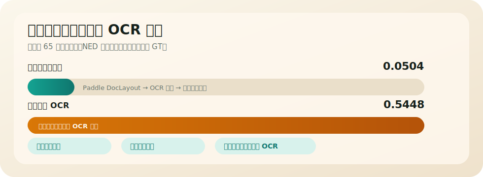

# NuosuBburma OCR：真实场景中的规范彝文识别

<p align="center">
  <a href="https://huggingface.co/nanxidajun/NuosuBburma-OCR"></a>
  <a href="https://huggingface.co/datasets/nanxidajun/NuosuBburma-OCR-Evaluation-Set"></a>
  
  
</p>

本项目是面向 **PaddleOCR 全球衍生模型挑战赛** 的规范彝文（ꆈꌠꁱꂷ / Nuosu Bburma）文字识别模型。赛事鼓励开发者基于 PaddleOCR-VL 选择长尾文字识别场景、自定义任务方向并开源可复现成果；本项目选择的任务是 **真实场景中的规范彝文识别**。

这里的“真实场景”包括旧书扫描、教材工具书页面、场景实拍、屏幕实拍、手写照片等等。规范彝文已有稳定书写体系，也有大量真实资料，但作为低资源少数民族文字，许多内容仍停留在图片和纸页里，不能搜索，不能复制，也很难进入后续语料建设。

因此，项目把重心放在一条从真实复杂资料到可用文本的链路上：先把整页图片切成更稳定的识别单元，再完成文字识别、合并页面文本和按需注音。最终目标是产出可检索、可校对、可进入语料库的 Unicode 文本，而不止是在几张样例图上“看起来会读”。这也是本项目作为衍生模型的赛事定位：补充 PaddleOCR-VL 在低资源民族文字场景中的真实评估、训练数据和复现入口。

[Hugging Face 模型](https://huggingface.co/nanxidajun/NuosuBburma-OCR) · [Hugging Face 评估集](https://huggingface.co/datasets/nanxidajun/NuosuBburma-OCR-Evaluation-Set) · [线上演示](https://huggingface.co/spaces/nanxidajun/NuosuBburma-OCR-Demo) · [提交说明](docs/COMPETITION_SUBMISSION.md) · [评估集说明](docs/EVALUATION_DATASET.md) · [训练数据构建](docs/TRAINING_DATA_CONSTRUCTION_REPORT.md)

线上演示空间是交互入口；没有配置 GPU 时，完整模型推理、页面切割复现和批量评估以本地演示脚本为准。

## 赛事评审入口

本仓库按官方评分表组织入口，方便评委快速检查数据、任务、训练、模型和复现。

| 评分维度 | 本项目证据 | 快速入口 |
|---|---|---|
| 评估集质量 | `603` 条真实主评估样本，含单行图 `515` 条、区域图 `84` 条、整页图 `4` 条；覆盖新印刷、旧印刷、手写拍照、实拍/屏幕；合成样本不进入主评估 | [评估集说明](docs/EVALUATION_DATASET.md)，[质检报告](docs/EVALUATION_QUALITY_REPORT.md) |
| 场景稀缺性 | 规范彝文公开文字识别资源少；本项目覆盖旧书、教材、工具书、彝汉混排、注音、手写和实拍资料 | [项目背景](docs/PROJECT_BACKGROUND.md) |
| 任务复杂度 | 整页、PDF 和照片先用 Paddle DocLayout 做页面切割，再识别、恢复阅读顺序、合并页面文本，并导出标题、正文、页码和彝汉对照行等结构化结果 | [页面切割](page_processing/README.md)，[演示](demo/README.md) |
| 训练数据科学性 | 训练包 `21504` 行；真实材料、训练侧合成样本和视觉变化样本分开记录；每次构建检查缺图、空标签、替换符、反斜杠、公式化片段和高风险格式比例 | [训练数据构建](docs/TRAINING_DATA_CONSTRUCTION_REPORT.md)，[训练包清单](configs/train_data_manifest_v5_16.json) |
| 微调策略与创新 | 三阶段 LoRA 微调；先证明单书真实行图可学，再补低频字符和旧印刷视觉变化，最后用固定开发诊断集比较分支，不把诊断集写回训练 | [模型与训练](docs/MODEL_AND_TRAINING.md)，[训练数据构建](docs/TRAINING_DATA_CONSTRUCTION_REPORT.md) |
| 开源与复现 | Hugging Face 模型、Hugging Face 评估集、线上演示、本地命令行演示、训练配置、评估脚本、逐样本输出和分组图表 | [演示](demo/README.md)，[scripts](scripts/README.md)，[model](model/README.md) |

当前提交模型在 `603` 条主评估样本上的平均归一化编辑距离（Avg NED）为 `0.036068`，越低越好。只看彝文字符时为 `0.038309`，只看汉字时为 `0.022447`。

输出风险检查结果为：替换符 `0`，公式化片段 `2`，多余拉丁字母 `0`，异常长输出 `0`。

清晰单行图和区域图是当前最可靠的输入；复杂整页和手写拍照单独报告，不和清晰印刷体混成一个结论。

## 交付内容

| 交付 | 内容 | 入口 |
|---|---|---|
| 模型 | 基于 `PaddleOCR-VL-1.6 (0.9B)` 的 LoRA 微调模型，固定提示词为 `<image>OCR:` | [model](model/README.md)，[Hugging Face 模型](https://huggingface.co/nanxidajun/NuosuBburma-OCR) |
| 真实评估集 | 真实来源样本，按视觉场景、输入粒度、文字混合和难度分层统计；主评估不使用合成样本 | [评估集说明](docs/EVALUATION_DATASET.md)，[质检报告](docs/EVALUATION_QUALITY_REPORT.md)，[Hugging Face 评估集](https://huggingface.co/datasets/nanxidajun/NuosuBburma-OCR-Evaluation-Set) |
| 页面切割与识别流程 | 从整页、PDF、照片开始，切出识别单元，按阅读顺序合并页面文本，并导出可复核的结构化页面结果 | [页面切割流程](page_processing/README.md)，[演示](demo/README.md)，[后处理工具](postprocess/README.md) |
| 训练数据构建 | 真实材料定边界，合成样本补字符长尾，视觉变化样本覆盖字体、清晰度和旧印刷状态；训练包清单记录每类来源、比例上限、质检和隔离检查 | [训练数据构建](docs/TRAINING_DATA_CONSTRUCTION_REPORT.md)，[configs](configs/) |
| 复现工具 | 线上演示入口、单图演示、整页演示、评估脚本、训练脚本、模型/评估集下载说明 | [演示](demo/README.md)，[scripts](scripts/README.md)，[提交说明](docs/COMPETITION_SUBMISSION.md) |

## 页面切割与识别流程

真实规范彝文资料常包含旧书页、页面照片、彝汉混排、脚注、注音和手写内容。本项目不是只做裁好的单行识别，也提供从整页、PDF、照片到可校对页面文本的流程。


核心链路是：Paddle DocLayout 页面切割 -> OCR 单元识别 -> 按阅读顺序合并页面文本 -> 导出结构化页面结果 -> 异常检查 -> 可选注音。入口见 [页面切割流程](page_processing/README.md)、[整页演示](demo/README.md)、[拼合脚本](page_processing/assemble_pages.py)、[结构化脚本](page_processing/structure_pages.py) 和 [注音工具](postprocess/add_nuosu_pronunciation.py)。

### 整页切割对比实验

《雪族子史篇》全书 65 页整页样本用于对比两种路径：整页图像直接进入模型识别，以及先用 Paddle DocLayout 做页面切割后再识别并合并页面文本。该组样本是复杂整页压力测试，不混入 `603` 条主评估结果。



| 识别路径 | 平均归一化编辑距离（Avg NED） | 主要差异 |
|---|---:|---|
| 页面切割后识别 | `0.0504` | 阅读顺序更稳，彝汉配对更接近人工标注，非文字干扰更少 |
| 直接整页识别 | `0.5448` | 容易出现跨行、错行、彝汉配对拆散和图案误识别 |

这次完整跑通了 `65` 页、`2501` 个 OCR 单元：OCR 结果 `2501/2501` 正常，最终导出 `65` 页提交文本；替换符、空页和重复页均为 `0`。结构化页面结果进一步抽出 `1123` 行彝文原文和 `1060` 组彝汉对照行。详细说明见 [页面切割流程](docs/PAGE_PROCESSING.md)。

## 评估与训练

最终结果按 `NuosuBburma OCR Evaluation Set` 统计。PaddleOCR-VL 原始模型和当前提交模型使用同一评估集、脚本和指标。

结果表见 [提交说明](docs/COMPETITION_SUBMISSION.md)。评估集分布和质检见 [评估集说明](docs/EVALUATION_DATASET.md) 与 [质检报告](docs/EVALUATION_QUALITY_REPORT.md)。

训练侧用真实材料打底，合成样本补未见字和低频字；视觉变化样本用于覆盖字体、清晰度和旧印刷状态，并限制拉丁注音、脚注、多行区域等容易造成异常输出的样本比例。

详细构建过程见 [训练数据构建报告](docs/TRAINING_DATA_CONSTRUCTION_REPORT.md)，模型设置和分支选择见 [模型与训练说明](docs/MODEL_AND_TRAINING.md)。

## 复现

### 1. 准备环境

模型推理和批量评估建议使用 CUDA GPU 环境。CPU 环境可用于依赖检查和部分脚本连通性检查，不作为评估推荐路径。

```bash
conda create -n paddleocr-vl python=3.11 -y
conda activate paddleocr-vl
python -m pip install -U pip setuptools wheel
```

安装 PaddlePaddle GPU 版：

```bash
python -m pip install paddlepaddle-gpu==3.3.0 \
  -i https://www.paddlepaddle.org.cn/packages/stable/cu118/
```

安装本项目依赖：

```bash
python -m pip install -r requirements.txt
```

`requirements.txt` 已包含 Hugging Face CLI；安装完成后即可使用 `hf download`。

如果国内网络较慢，可先设置 Hugging Face 镜像：

```bash
export HF_ENDPOINT=https://hf-mirror.com
```

### 2. 下载模型和评估集

下载模型：

```bash
hf download nanxidajun/NuosuBburma-OCR \
  --repo-type model \
  --local-dir models/NuosuBburma-OCR
```

下载评估集：

```bash
hf download nanxidajun/NuosuBburma-OCR-Evaluation-Set \
  --repo-type dataset \
  --local-dir datasets/NuosuBburma_OCR_Evaluation_Set
```

### 3. 安装后自检

```bash
scripts/smoke_check.sh
```

这一步会检查 Python 依赖、样例图和模型目录；如果模型已经下载，会继续跑一张单图识别。

### 4. 运行演示

运行单图演示：

```bash
python demo/infer_single_image.py \
  --model models/NuosuBburma-OCR \
  --image demo/sample_images/mixed_line.png \
  --max-image-side 2400 \
  --html-output outputs/demo/mixed_line.html
```

运行整页演示：

```bash
python demo/run_page_workflow.py \
  --input demo/sample_images/screen_page.jpg \
  --model models/NuosuBburma-OCR \
  --output-root outputs/demo_page_workflow \
  --max-image-side 2400 \
  --with-pronunciation
```

### 5. 运行评估

运行评估：

```bash
scripts/run_eval.sh \
  models/NuosuBburma-OCR \
  datasets/NuosuBburma_OCR_Evaluation_Set/annotations.jsonl \
  outputs/NuosuBburma_OCR_Evaluation_Set/result.jsonl

python scripts/analyze_submission_eval.py \
  --annotations datasets/NuosuBburma_OCR_Evaluation_Set/annotations.jsonl \
  --result outputs/NuosuBburma_OCR_Evaluation_Set/result.jsonl \
  --out-dir outputs/NuosuBburma_OCR_Evaluation_Set/analysis
```

## 仓库结构

```text
configs/                         训练/导出配置与训练数据清单
NuosuBburma_OCR_Evaluation_Set/  评估集入口说明，完整数据托管在 Hugging Face 评估集仓库
page_processing/                 页面切割、页面文本拼合与结构化输出入口
demo/                            单图推理、整页演示与样例图
docs/                            提交说明、评估集、训练数据、模型训练和项目背景
evaluation/                      开发诊断结果、分组统计和逐样本输出
model/                           模型托管入口、下载命令和使用边界说明
postprocess/                     规范彝文注音工具
scripts/                         训练、评估和统计工具
```
