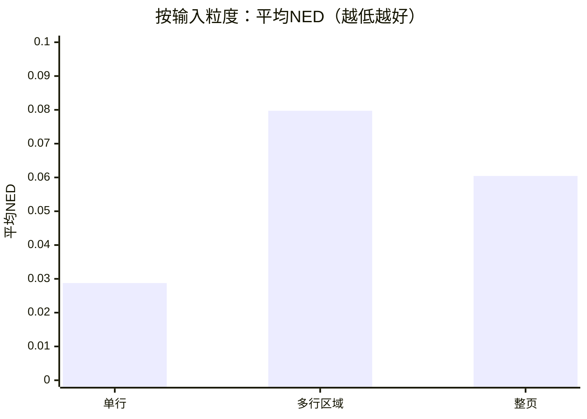
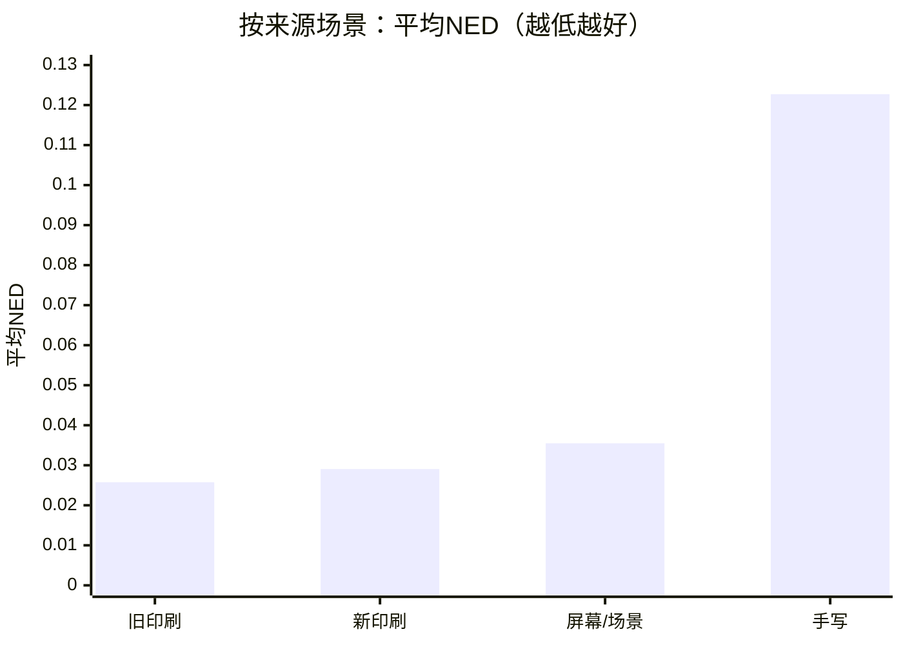
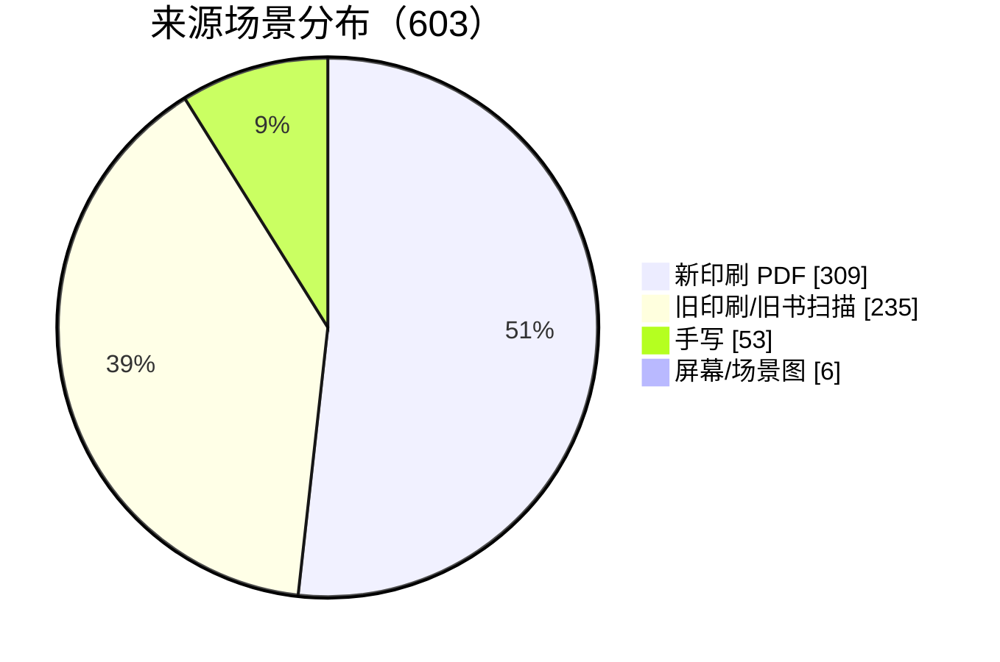
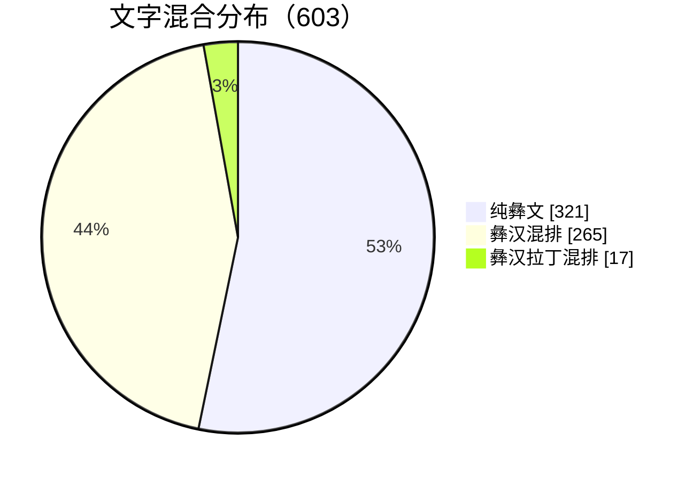
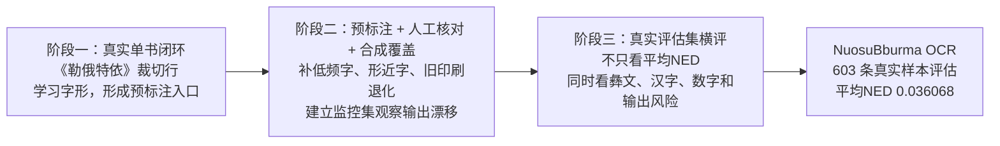

# NuosuBburma OCR

<p align="center">
  <a href="https://huggingface.co/nanxidajun/NuosuBburma-OCR"></a>
  <a href="https://huggingface.co/datasets/nanxidajun/NuosuBburma-OCR-Evaluation-Set"></a>
  
  
</p>

基于 `PaddleOCR-VL-1.6 (0.9B)` + LoRA 微调的低资源文字 OCR 解决方案，以规范彝文（ꆈꌠꁱꂷ / Nuosu Bburma）真实资料数字化为目标场景。

它不只让模型认识一套新文字，而是把真实资料整理、训练数据补覆盖、评估集构建、模型微调、输出风险诊断和复现入口放在同一条链路中。

项目从旧书《勒俄特依》的真实裁切行开始，逐步扩展到新旧印刷、彝汉混排、少量手写、屏幕图和整页/区域输入。目标很直接：把图片里的规范彝文转成可复制、可检索、可校对、可继续用于教学和语料建设的 Unicode 文本。

[Hugging Face 模型](https://huggingface.co/nanxidajun/NuosuBburma-OCR) · [HF 评估集](https://huggingface.co/datasets/nanxidajun/NuosuBburma-OCR-Evaluation-Set) · [切图流程](docs/CROP_PIPELINE.md) · [文档目录](docs/README.md) · [本地 Demo](demo/README.md)

## 项目概览

| 真实评估 | 文字识别质量 | 混排识别 | 输出稳定性 |
|---|---|---|---|
| **603** 条真实样本 | 平均NED **0.036068** | 汉字部分完全匹配 **93.99%** | 未出现替换符 |
| 单行、区域、整页全部纳入 | 彝文部分完全匹配 **74.96%** | 覆盖纯彝文、彝汉混排、彝汉拉丁混排 | 未出现异常长输出 |

| 低资源文字场景 | 开放材料 | 工程链路 | 训练策略 |
|---|---|---|---|
| 从真实旧书出发，补齐数据、评估和复现链路 | HF 模型 + HF 评估集 | 配置、脚本、结果表可复查 | 真实样本锚定 + 合成数据补覆盖 + 监控集诊断 |

## 当前结果

最终模型在 `NuosuBburma OCR Evaluation Set` 的 `603` 条真实样本上评估。评估集不使用合成样本，结果对应真实材料表现。

| 样本 | 平均NED | 完全匹配率 | 彝文部分完全匹配 | 汉字部分完全匹配 | 输出风险 |
|---:|---:|---:|---:|---:|---|
| 603 | 0.036068 | 67.99% | 74.96% | 93.99% | 替换符 / 公式化输出 / 多余拉丁字母 / 异常长输出 = `0 / 2 / 18 / 0` |

按输入粒度看，清晰行图已经比较稳定，多行区域和整页更容易暴露版面边界问题：



按来源场景看，新旧印刷样本表现稳定，手写仍是最难场景：



完整结果见 [`evaluation/`](evaluation/)。

## 为什么做这个

规范彝文已经形成稳定字符体系，但大量资料仍停留在图片、扫描件和纸质书稿中。现有通用 OCR 基本不能直接识别规范彝文，公开可复用的数据集、模型和评估基准也很少。这个项目的起点不是拿现成数据微调，而是在几乎没有可用 OCR 数据的情况下，从真实书页、裁切行和人工校对开始建立训练与评估入口。

低资源文字 OCR 的难点不只是“训练样本少”。更现实的问题是：真实资料难整理、标注成本高、字符覆盖不均；为了补齐低频字、形近字和旧印刷视觉变化，又必须谨慎使用合成数据。合成数据比例和形态稍有偏差，才会在训练调优中带来混排、符号、多余拉丁字母、长输出等风险。本项目把这些训练风险纳入监控和评估，服务于后续校对、检字、注音和语料建设。

它要处理的是 1165 个规范彝文字符、形近字、旧书噪声、彝汉混排、少量手写和复杂版面边界。

```text
PDF / 图片
-> 页面渲染或切图
-> 整页 / 区域 / 单行 OCR
-> Unicode 文本
-> 检索、复制、校对、注音、语料建设
```

## 评估集构成

评估集共 `603` 条真实样本，引用图片 `603` 张，覆盖新印刷、旧印刷、手写、屏幕/场景图、彝汉混排和少量拉丁注音。样本以单行为主，同时保留 `84` 条多行区域和 `4` 条整页样本，用来观察版面边界问题。





这组评估集的作用不是追求最大规模，而是覆盖真实使用中最容易出问题的部分：换书、换字体、换版式、旧印刷、手写、区域/整页、脚注、数字、彝汉混排和注音附近的输出稳定性。

## 三阶段调优路线

三阶段路线来自低资源文字的现实起点：没有现成 OCR 数据，也没有可以直接拿来评估的公开基准。因此训练不是一次性堆数据，而是先用真实旧书跑通最小闭环，再用中间模型做预标注、人工核对，逐步扩展训练集和评估集。

训练从一本旧书《勒俄特依》的真实裁切行开始。第一阶段先确认 PaddleOCR-VL LoRA 能学到规范彝文字形，并产出可用于人工核对的预标注能力；第二阶段加入合成覆盖和监控集，补低频字、形近字和旧印刷变化；第三阶段再用真实评估集横向比较，避免模型只适应合成样本或单一本书。



最终模型不是简单“多加数据”得到的。低资源文字必须用合成样本补覆盖，但合成样本一旦失衡，就可能把模型推向错误的输出习惯。中间多次实验显示，版式、脚注、结尾格式一类样本会修局部问题，也可能重新打开多余拉丁字母、公式化输出或长输出风险。最终选择的分支使用受控重渲染扩大视觉分布，同时限制拉丁字母、脚注和近似多行区域这类高风险通道。

关键训练信息：

| 项目 | 内容 |
|---|---|
| 基座模型 | `PaddleOCR-VL-1.6 (0.9B)` |
| 微调方式 | LoRA |
| 训练硬件 | NVIDIA RTX 4090D |
| 训练行数 | 21504 |
| epochs | 2 |
| train loss | 0.191 |
| max sequence length | 16384 |
| LoRA rank | 8 |
| batch size / grad accumulation | 4 / 16 |
| learning rate | 5.0e-4 |
| precision | bf16 |

训练配置和 manifest 见 [`configs/`](configs/)，模型路线说明见 [模型与训练说明](docs/MODEL_AND_TRAINING.md)。

## 开始使用

下载模型：

```bash
hf download nanxidajun/NuosuBburma-OCR \
  --repo-type model \
  --local-dir models/NuosuBburma-OCR
```

下载评估集：

```bash
hf download nanxidajun/NuosuBburma-OCR-Evaluation-Set \
  --repo-type dataset \
  --local-dir datasets/NuosuBburma_OCR_Evaluation_Set
```

运行评估：

```bash
scripts/run_eval.sh \
  models/NuosuBburma-OCR \
  datasets/NuosuBburma_OCR_Evaluation_Set/annotations.jsonl \
  outputs/NuosuBburma_OCR_Evaluation_Set/result.jsonl

python scripts/analyze_submission_eval.py \
  --annotations datasets/NuosuBburma_OCR_Evaluation_Set/annotations.jsonl \
  --result outputs/NuosuBburma_OCR_Evaluation_Set/result.jsonl \
  --out-dir outputs/NuosuBburma_OCR_Evaluation_Set/analysis
```

本地单图 demo：

```bash
python demo/infer_single_image.py \
  --model models/NuosuBburma-OCR \
  --image demo/sample_images/mixed_line.png
```

固定提示词：

```text
<image>OCR:
```

整页扫描件建议先切图再识别：

```bash
python3 scripts/run_book_crop_pipeline.py \
  --input page_images \
  --output-root outputs/crop_pipeline_demo
```

切图结果会生成 `03_cut_before_after_review/` 供人工快速检查，并在 `04_successful_crop_summary/01_line_ocr_ready/` 汇总可进入行级 OCR 的图片。完整说明见 [切图流程](docs/CROP_PIPELINE.md)。

## 仓库结构

```text
configs/                         训练/导出配置与训练数据 manifest 快照
NuosuBburma_OCR_Evaluation_Set/  评估集入口说明，完整数据托管在 Hugging Face Dataset
demo/                            单图推理 demo 与样例图
docs/                            项目背景、评估集、模型训练和提交说明
evaluation/                      603 条真实评估集结果与统计表
model/                           模型托管入口、下载命令和使用边界说明
postprocess/                     切行 OCR 结果合并、规范彝文注音工具
scripts/                         训练、评估、统计和切图工具
```

## 文档

- [文档目录](docs/README.md)
- [提交材料总览](docs/COMPETITION_SUBMISSION.md)
- [项目背景与任务定义](docs/PROJECT_BACKGROUND.md)
- [评估集说明](docs/EVALUATION_DATASET.md)
- [模型与训练说明](docs/MODEL_AND_TRAINING.md)
- [书页切图流程](docs/CROP_PIPELINE.md)
- [后处理工具](postprocess/README.md)
- [模型入口](model/README.md)
- [评估集入口](NuosuBburma_OCR_Evaluation_Set/README.md)

## 使用边界

- 支持整页、区域、单行图像输入。
- 当前最稳定的使用方式通常是单行/区域 OCR。
- 复杂整页文档在版面较密、手写、多栏、脚注、注音块或图文混排较强时，建议配合 [切图流程](docs/CROP_PIPELINE.md)、版面分析或人工复核。
- 手写样本已有一定泛化能力，但稳定性弱于印刷体。
- 本版本尚未进行专门的端侧/移动端优化。

## 作者

NanxiDajun
