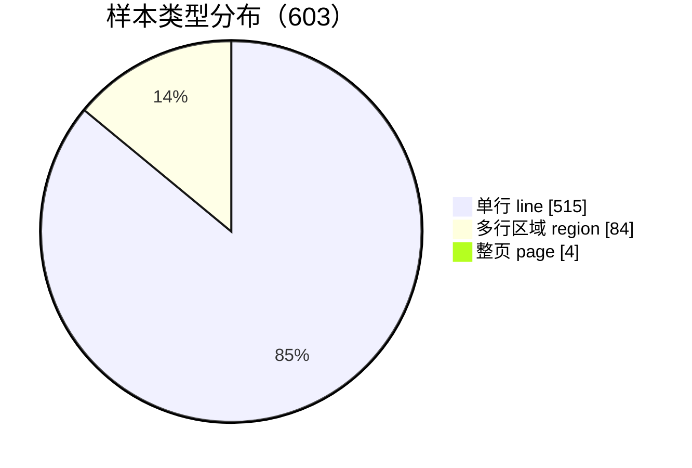
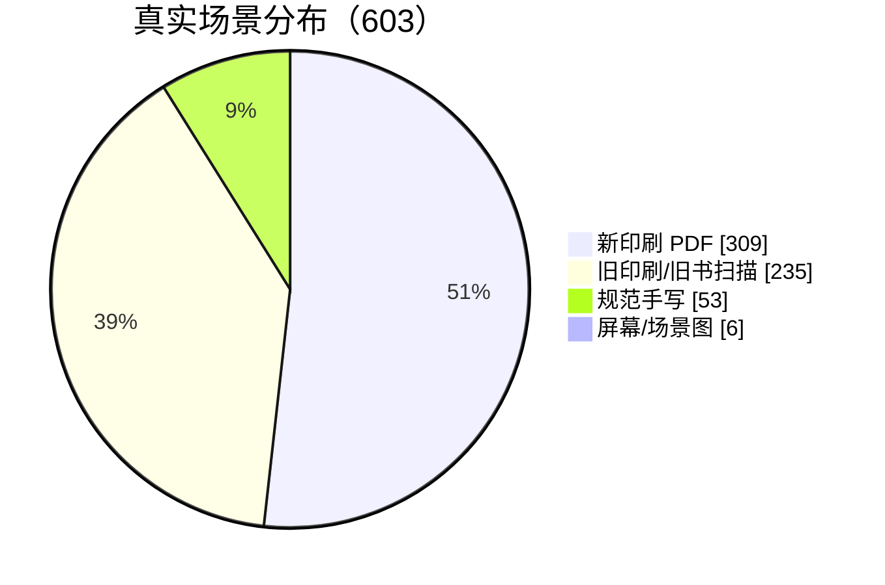
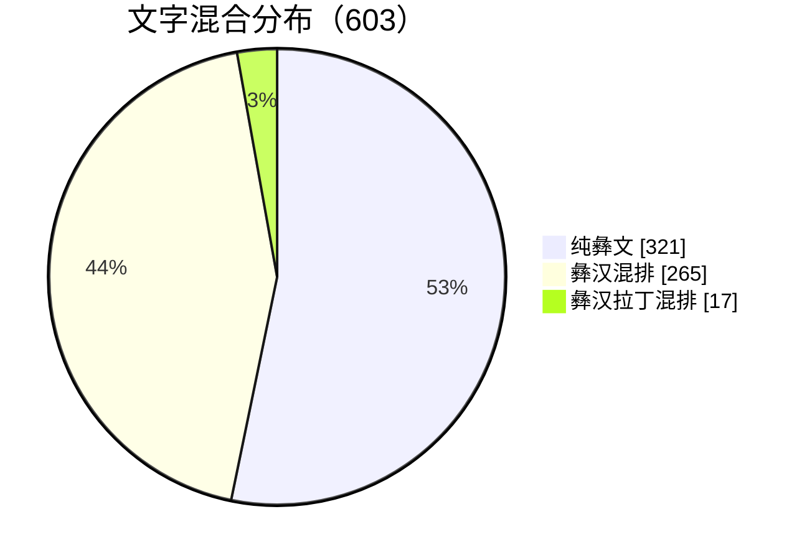
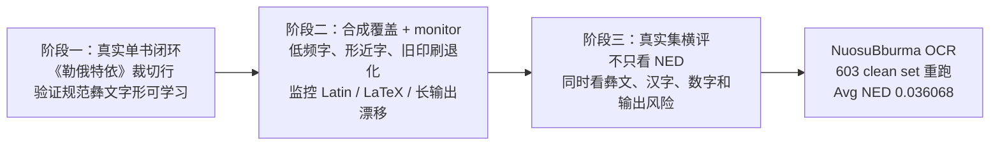

# NuosuBburma OCR

<p align="center">
  <a href="https://huggingface.co/nanxidajun/NuosuBburma-OCR"></a>
  <a href="https://huggingface.co/datasets/nanxidajun/NuosuBburma-OCR-Evaluation-Set"></a>
  
  
</p>

基于 `PaddleOCR-VL-1.6 (0.9B)` + LoRA 微调的规范彝文 OCR 项目，面向规范彝文（ꆈꌠꁱꂷ / Nuosu Bburma）真实资料数字化。

项目从旧书《勒俄特依》的真实裁切行开始，逐步扩展到新旧印刷、彝汉混排、少量手写、屏幕图和整页/区域输入。目标很直接：把图片里的规范彝文转成可复制、可检索、可校对、可继续用于教学和语料建设的 Unicode 文本。

[Hugging Face 模型](https://huggingface.co/nanxidajun/NuosuBburma-OCR) · [HF 评估集](https://huggingface.co/datasets/nanxidajun/NuosuBburma-OCR-Evaluation-Set) · [文档目录](docs/README.md) · [本地 Demo](demo/README.md)

## 项目概览

| 真实评估 | 识别质量 | 混排表现 | 输出稳定性 |
|---|---|---|---|
| **603** 条真实样本 | **0.036068** Avg NED | **93.99%** Han-only exact | replacement **0** |
| line / region / page 全纳入 | **74.96%** Yi-only exact | yi / yi_han / yi_han_latin | long_pred **0** |

| 开放材料 | 工程链路 | 训练策略 | 使用边界 |
|---|---|---|---|
| HF Model + HF Dataset | 配置、脚本、结果表可复查 | 真实锚点 + 合成覆盖 + monitor 诊断 | 支持 page / region / line，复杂整页建议配合切图 |

## 当前结果

最终模型在 `NuosuBburma OCR Evaluation Set` 的 `603` 条真实样本上重跑。评估集不使用合成样本，结果对应真实材料表现。

| 样本 | Avg NED | Exact match | Yi-only exact | Han-only exact | 输出风险 |
|---:|---:|---:|---:|---:|---|
| 603 | 0.036068 | 67.99% | 74.96% | 93.99% | replacement / LaTeX / ASCII-letter / long_pred = `0 / 2 / 18 / 0` |

按输入粒度看，清晰行图已经比较稳定，多行区域和整页更容易暴露版面边界问题：

| 输入类型 | 样本数 | Avg NED | Exact match | 说明 |
|---|---:|---:|---:|---|
| line | 515 | 0.028758 | 72.62% | 当前最稳定的使用形态 |
| region | 84 | 0.079725 | 42.86% | 更容易出现漏行和边界错误 |
| page | 4 | 0.060449 | 0.00% | 支持整页输入；复杂版式建议配合切图 |

按来源场景看，新旧印刷样本表现稳定，手写仍是最难场景：

| 场景 | 样本数 | Avg NED | 说明 |
|---|---:|---:|---|
| new_print_pdf | 309 | 0.029050 | 新印刷 PDF |
| old_print_pdf | 235 | 0.025771 | 旧书扫描/旧印刷 |
| neat_handwriting | 53 | 0.122708 | 规范手写，泛化场景 |
| screen_or_scene | 6 | 0.035492 | 屏幕图/真实场景图 |

完整结果见 [`evaluation/NuosuBburma_OCR_Evaluation_Set/`](evaluation/NuosuBburma_OCR_Evaluation_Set/)。

## 为什么做这个

规范彝文已经形成稳定字符体系，但大量资料仍停留在图片、扫描件和纸质书稿中。现有通用 OCR 对规范彝文支持有限，常见问题包括漏识别、乱码、形近字混淆、混排错位和输出漂移。

这个项目把低资源文字 OCR 拆成一条可复查的资料整理链路：真实资料进入，OCR 输出 Unicode 文本，后续继续接校对、检字、注音和语料建设。它要处理的是 1165 个规范彝文字符、形近字、旧书噪声、彝汉混排、少量手写和复杂版面边界。

```text
PDF / 图片
-> 页面渲染或切图
-> page / region / line OCR
-> Unicode 文本
-> 检索、复制、校对、注音、语料建设
```

## 评估集构成

评估集共 `603` 条真实样本，引用图片 `603` 张，覆盖新印刷、旧印刷、规范手写、屏幕/场景图、彝汉混排和少量拉丁注音。







这组评估集的作用不是追求最大规模，而是覆盖真实使用中最容易出问题的部分：换书、换字体、换版式、旧印刷、手写、region/page、脚注、数字、彝汉混排和注音附近的输出稳定性。

## 三阶段调优路线

训练从一本旧书《勒俄特依》的真实裁切行开始。先确认 PaddleOCR-VL LoRA 能学到规范彝文字形，再逐步加入合成覆盖、monitor 诊断和真实评估集横向比较。



最终模型不是简单“多加数据”得到的。中间多次实验显示，layout、脚注、safe-ending 一类样本会修局部问题，也可能重新打开 Latin、LaTeX 或长输出风险。最终选择的分支使用受控重渲染扩大视觉分布，同时限制 Latin、脚注和 region-like 高风险通道。

关键训练信息：

| 项目 | 内容 |
|---|---|
| 基座模型 | `PaddleOCR-VL-1.6 (0.9B)` |
| 微调方式 | LoRA |
| 训练硬件 | NVIDIA RTX 4090D |
| 训练行数 | 21504 |
| epochs | 2 |
| train loss | 0.191 |
| max sequence length | 16384 |
| LoRA rank | 8 |
| batch size / grad accumulation | 4 / 16 |
| learning rate | 5.0e-4 |
| precision | bf16 |

训练配置和 manifest 见 [`configs/`](configs/)，模型路线说明见 [模型与训练说明](docs/MODEL_AND_TRAINING.md)。

## 开始使用

下载模型：

```bash
hf download nanxidajun/NuosuBburma-OCR \
  --repo-type model \
  --local-dir models/NuosuBburma-OCR
```

下载评估集：

```bash
hf download nanxidajun/NuosuBburma-OCR-Evaluation-Set \
  --repo-type dataset \
  --local-dir datasets/NuosuBburma_OCR_Evaluation_Set
```

运行评估：

```bash
scripts/run_eval.sh \
  models/NuosuBburma-OCR \
  datasets/NuosuBburma_OCR_Evaluation_Set/annotations.jsonl \
  outputs/NuosuBburma_OCR_Evaluation_Set/result.jsonl

python scripts/analyze_submission_eval.py \
  --annotations datasets/NuosuBburma_OCR_Evaluation_Set/annotations.jsonl \
  --result outputs/NuosuBburma_OCR_Evaluation_Set/result.jsonl \
  --out-dir outputs/NuosuBburma_OCR_Evaluation_Set/analysis
```

本地单图 demo：

```bash
python demo/infer_single_image.py \
  --model models/NuosuBburma-OCR \
  --image demo/sample_images/mixed_line.png
```

固定提示词：

```text
<image>OCR:
```

## 仓库结构

```text
configs/                         训练/导出配置与训练数据 manifest 快照
NuosuBburma_OCR_Evaluation_Set/  评估集入口说明，完整数据托管在 HF Dataset
demo/                            单图推理 demo 与样例图
docs/                            项目背景、评估集、模型训练和提交说明
evaluation/                      603 条真实评估集重跑结果与统计表
model/                           模型托管入口、下载命令和使用边界说明
scripts/                         训练、评估、统计工具
```

## 文档

- [文档目录](docs/README.md)
- [提交材料总览](docs/COMPETITION_SUBMISSION.md)
- [项目背景与任务定义](docs/PROJECT_BACKGROUND.md)
- [评估集说明](docs/EVALUATION_DATASET.md)
- [模型与训练说明](docs/MODEL_AND_TRAINING.md)
- [模型入口](model/README.md)
- [评估集入口](NuosuBburma_OCR_Evaluation_Set/README.md)

## 使用边界

- 支持 page / region / line 图像输入。
- 当前最稳定的使用方式通常是 line / region OCR。
- 复杂整页文档在版面较密、手写、多栏、脚注、注音块或图文混排较强时，建议配合版面分析、切图流程或人工复核。
- 手写样本已有一定泛化能力，但稳定性弱于印刷体。
- 本版本尚未进行专门的端侧/移动端优化。

## 作者

NanxiDajun
