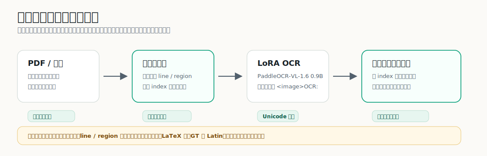
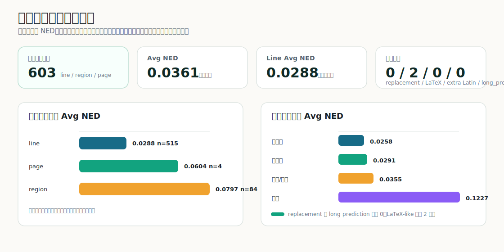
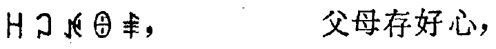
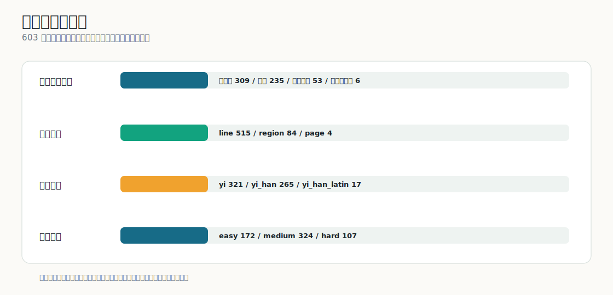
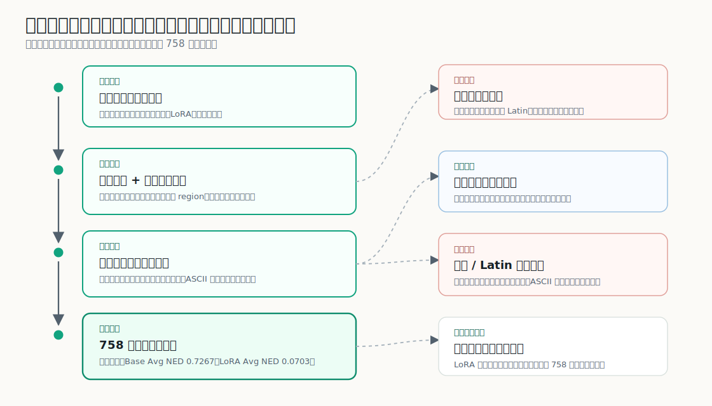
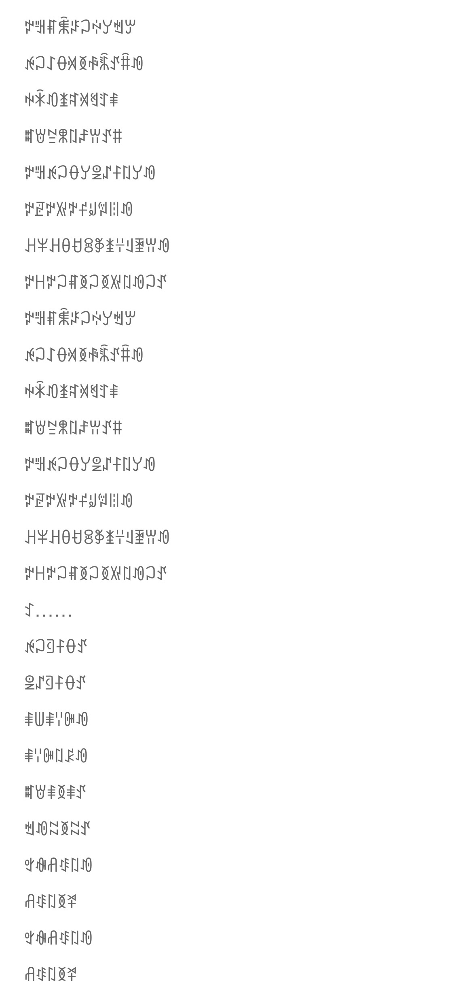

# 规范彝文 OCR / NuosuBburma OCR

<p align="center">
  <a href="https://huggingface.co/nanxidajun/NuosuBburma-OCR"></a>
  <a href="https://huggingface.co/datasets/nanxidajun/NuosuBburma-OCR-Evaluation-Set"></a>
  
  
</p>

`规范彝文 OCR / NuosuBburma OCR` 是一个基于 `PaddleOCR-VL-1.6 (0.9B)` + LoRA 微调的低资源 OCR 项目，面向规范彝文（ꆈꌠꁱꂷ / Nuosu Bburma）真实资料数字化。

这个项目是从几乎没有规范彝文 OCR 数据的情况下做起来的。最早的入口是旧书《勒俄特依》的真实裁切行和人工核对；接着把切图、预标注、LoRA 微调、真实评估、页面文本合并和注音后处理一项项接起来。现在从整页/PDF 到行图，再到 OCR 和页面文本整理，链路已经跑通。

目标很朴素：把旧书扫描、教材页面、彝汉混排、少量手写和页面照片中的规范彝文，转成可复制、可检索、可校对、可继续用于教学、注音和语料建设的 Unicode 文本。

[Hugging Face 模型](https://huggingface.co/nanxidajun/NuosuBburma-OCR) · [HF 评估集](https://huggingface.co/datasets/nanxidajun/NuosuBburma-OCR-Evaluation-Set) · [切图 Pipeline](crop_pipeline/README.md) · [后处理工具](postprocess/README.md) · [文档目录](docs/README.md) · [本地 Demo](demo/README.md)



## 项目概览

| 真实评估 | 主要结果 | 输出稳定性 | 工程交付 |
|---|---|---|---|
| **603** 条真实样本，不使用合成样本证明主结果 | Avg NED **0.036068**，line Avg NED **0.028758** | replacement / LaTeX / extra Latin / long_pred = `0 / 2 / 0 / 0` | HF 模型、HF 评估集、评估脚本、本地 demo、切图和后处理工具 |

| 低资源问题 | 项目处理方式 |
|---|---|
| 几乎没有规范彝文 OCR 数据和公开基准 | 从真实旧书裁切行起步，建立人工核对评估集 |
| 字符覆盖和形近字不足 | 用受控合成样本补低频字、形近字和旧印刷视觉变化 |
| 合成数据容易带来漂移 | 用 reviewed 真实集和输出风险指标共同选择模型 |
| 真实资料包含整页和 PDF | 提供切图 pipeline，把整页/PDF 拆成可复核行图或区域后识别，再合并回页面文本 |

## 当前结果

最终模型在 `NuosuBburma OCR Evaluation Set` 的 `603` 条真实样本上评估。主展示使用 NED 和输出风险；逐字全等口径对标点、空格和换行过于敏感，不作为首页判断依据。



| 指标 | 结果 | 说明 |
|---|---:|---|
| Avg NED | 0.036068 | 603 条真实样本整体结果 |
| WS Avg NED | 0.034219 | 忽略空白差异后的结果 |
| NFKC+WS Avg NED | 0.033964 | Unicode 兼容规范化并忽略空白后的结果 |
| Yi-only Avg NED | 0.038309 | 单独观察彝文主体识别 |
| Han-only Avg NED | 0.022447 | 单独观察彝汉混排中的汉字 |
| Digit-only Avg NED | 0.139918 | 数字、页码和编号仍是弱项 |
| replacement / LaTeX / extra Latin / long_pred | 0 / 2 / 0 / 0 | 严格输出风险统计，`extra Latin` 指 GT 无 Latin 但预测多出 Latin |
| ASCII-letter rows | 18 / 18 | 预测含 Latin 的 18 条，GT 本身也都有 Latin 注音，不计作多余拉丁漂移 |

按输入粒度看，清晰行图已经比较稳定，多行区域和整页更容易暴露版面边界问题：


按来源场景看，新旧印刷样本表现稳定，手写仍是最难场景：


完整结果见 [`evaluation/`](evaluation/)。

## 为什么做这个

规范彝文已经形成稳定字符体系，但大量资料仍停留在图片、扫描件和纸质书稿中。现有通用 OCR 基本不能直接识别规范彝文，公开可复用的数据集、模型和评估基准也很少。这个项目从几乎没有可用 OCR 数据的状态起步，先从真实书页、裁切行和人工校对建立训练与评估入口。

低资源文字 OCR 很快会遇到几个问题：真实资料难整理，标注成本高，字符覆盖不均。为了补齐低频字、形近字和旧印刷视觉变化，又必须谨慎使用合成数据。合成数据比例和形态稍有偏差，就可能在训练调优中带来混排、符号、GT 外 Latin 尾巴、长输出等风险。本项目把这些训练风险纳入监控和评估，服务于后续校对、检字、注音和语料建设。

它要处理的是 1165 个规范彝文字符、形近字、旧书噪声、彝汉混排、少量手写和复杂版面边界。下面是一条真实彝汉混排行图示例：

<p align="center">
  
</p>

## 评估集构成

评估集共 `603` 条真实样本，引用图片 `603` 张，覆盖新印刷、旧印刷、手写、页面照片、实拍场景、彝汉混排和少量拉丁注音。样本以单行为主，同时保留 `84` 条多行区域和 `4` 条整页样本，用来观察版面边界问题。



这组评估集没有追求最大规模。它更在意真实使用里容易出问题的部分：换书、换字体、换版式、旧印刷、手写、区域/整页、脚注、数字、彝汉混排和注音附近的输出稳定性。

## 三阶段调优路线

三阶段路线来自低资源文字的现实起点：没有现成 OCR 数据，也没有可以直接拿来评估的公开基准。训练先用真实旧书跑通最小闭环，再用中间模型做预标注和人工核对，慢慢扩展训练集和评估集。

训练从一本旧书《勒俄特依》的真实裁切行开始。第一阶段先确认 PaddleOCR-VL LoRA 能学到规范彝文字形，并产出可用于人工核对的预标注能力；第二阶段加入合成覆盖和监控集，补低频字、形近字和旧印刷变化；第三阶段再用真实评估集横向比较，避免模型只适应合成样本或单一本书。



最终模型没有靠“多加数据”堆出来。低资源文字必须用合成样本补覆盖，但合成样本一旦失衡，就可能把模型推向错误的输出习惯。中间多次实验显示，版式、脚注、结尾格式一类样本会修局部问题，也可能重新打开 GT 外 Latin 尾巴、公式化输出或长输出风险。最终选择的分支使用受控重渲染扩大视觉分布，同时限制拉丁字母、脚注和近似多行区域这类高风险通道。

关键训练信息：

| 项目 | 内容 |
|---|---|
| 基座模型 | `PaddleOCR-VL-1.6 (0.9B)` |
| 微调方式 | LoRA |
| 训练硬件 | NVIDIA RTX 4090D |
| 训练行数 | 21504 |
| epochs | 2 |
| train loss | 0.191 |
| max sequence length | 16384 |
| LoRA rank | 8 |
| batch size / grad accumulation | 4 / 16 |
| learning rate | 5.0e-4 |
| precision | bf16 |

训练配置和 manifest 见 [`configs/`](configs/)，模型路线说明见 [模型与训练说明](docs/MODEL_AND_TRAINING.md)。

## 开始使用

如本地没有 `hf` 命令，先安装 Hugging Face CLI：

```bash
pip install -U "huggingface_hub[cli]"
```

下载模型：

```bash
# 国内网络较慢时，取消下一行注释使用 HF 镜像：
# export HF_ENDPOINT=https://hf-mirror.com

hf download nanxidajun/NuosuBburma-OCR \
  --repo-type model \
  --local-dir models/NuosuBburma-OCR
```

下载评估集：

```bash
# 国内网络较慢时，取消下一行注释使用 HF 镜像：
# export HF_ENDPOINT=https://hf-mirror.com

hf download nanxidajun/NuosuBburma-OCR-Evaluation-Set \
  --repo-type dataset \
  --local-dir datasets/NuosuBburma_OCR_Evaluation_Set
```

运行评估：

```bash
scripts/run_eval.sh \
  models/NuosuBburma-OCR \
  datasets/NuosuBburma_OCR_Evaluation_Set/annotations.jsonl \
  outputs/NuosuBburma_OCR_Evaluation_Set/result.jsonl

python scripts/analyze_submission_eval.py \
  --annotations datasets/NuosuBburma_OCR_Evaluation_Set/annotations.jsonl \
  --result outputs/NuosuBburma_OCR_Evaluation_Set/result.jsonl \
  --out-dir outputs/NuosuBburma_OCR_Evaluation_Set/analysis
```

本地单图 demo：

```bash
python demo/infer_single_image.py \
  --model models/NuosuBburma-OCR \
  --image demo/sample_images/mixed_line.png
```

固定提示词：

```text
<image>OCR:
```

### 实用工作流：切图、合并、注音

真实使用时，输入经常是 PDF、整页扫描件、页面照片或拍照图，不会天然就是干净单行。因此仓库把流程拆成两层：`crop_pipeline/` 负责把页面切成可复核行图，`postprocess/` 负责把行 OCR 结果汇总回页面文本，默认保留切行换行，并给规范彝文结果加注音。这是面向校对、教学、检字和语料整理的实用入口。

同一张页面照片可以有两种用法。文字区域比较干净、只想快速得到一段结果时，可以直接整块识别；如果页面较长、多行较多，建议先切图，再对行图做 OCR。下面使用的是一张带人工 GT 的样例图，切图示例见 [`crop_pipeline/examples/screen_page/`](crop_pipeline/examples/screen_page/)。

<p>
  
</p>

方式 A：整块 / 区域直接识别。

```bash
python demo/infer_single_image.py \
  --model models/NuosuBburma-OCR \
  --image crop_pipeline/examples/screen_page/screen_page_with_gt.jpg
```

方式 B：先切图，再识别行图。

```bash
mkdir -p outputs/screen_page_input
cp crop_pipeline/examples/screen_page/screen_page_with_gt.jpg outputs/screen_page_input/

python3 crop_pipeline/run.py \
  --input outputs/screen_page_input \
  --output-root outputs/screen_page_crop
```

PDF 也可以直接作为输入：

```bash
python3 crop_pipeline/run.py \
  --input book.pdf \
  --output-root outputs/book_crop \
  --max-pages 20
```

切图结果会生成：

```text
outputs/screen_page_crop/
  03_cut_before_after_review/                 # 看切图是否合理
  04_successful_crop_summary/01_line_ocr_ready/ # 可进入 OCR 的行图
  04_successful_crop_summary/index.csv        # 行图顺序和来源索引
  crop_pipeline_validation.json               # 切图索引校验结果
```

然后可以批量识别 `01_line_ocr_ready/` 中的行图：

```bash
python crop_pipeline/infer_line_crops.py \
  --model models/NuosuBburma-OCR \
  --index outputs/screen_page_crop/04_successful_crop_summary/index.csv \
  --summary-root outputs/screen_page_crop/04_successful_crop_summary \
  --output outputs/screen_page_crop/line_ocr_result.jsonl
```

切图完成后，后处理单独执行，不属于一键切图 pipeline：

```bash
python postprocess/merge_line_ocr_results.py \
  --results outputs/screen_page_crop/line_ocr_result.jsonl \
  --index outputs/screen_page_crop/04_successful_crop_summary/index.csv \
  --out-jsonl outputs/screen_page_crop/page_ocr_merged.jsonl \
  --out-txt-dir outputs/screen_page_crop/page_text

python postprocess/add_nuosu_pronunciation.py \
  --input outputs/screen_page_crop/page_ocr_merged.jsonl \
  --field text \
  --output outputs/screen_page_crop/page_ocr_merged_pronounced.jsonl
```

后处理示例里放了小样，方便直接看默认保留切行时输出长什么样。

页面汇总小样：

```text
输入行数: 4
匹配 index: 4/4
行间分隔: 默认换行

ꉢꅿꐥꐨꈝꃀꏢꌦꈐꏮ
ꉌꃀꋍꂷꄉꅉꊌꊊꀋꐙꀑ
ꑭꁗꀒꁧꉜꄉꄔꄸꑌ
ꐰꇐꊂꈹꇁꄏꀕꀋꐚ
```

注音文本小样：

```text
原文:
ꉢꅿꐥꐨꈝꃀꏢꌦꈐꏮ
ꉌꃀꋍꂷꄉꅉꊌꊊꀋꐙꀑ

pronunciation:
nga ni jjo jjux ggap mop ji sy ku jo
hxie mop cyp ma da dde wep wex ap jjix o

inline_pronunciation:
ꉢ(nga)ꅿ(ni)ꐥ(jjo)ꐨ(jjux)ꈝ(ggap)ꃀ(mop)ꏢ(ji)ꌦ(sy)ꈐ(ku)ꏮ(jo)
ꉌ(hxie)ꃀ(mop)ꋍ(cyp)ꂷ(ma)ꄉ(da)ꅉ(dde)ꊌ(wep)ꊊ(wex)ꀋ(ap)ꐙ(jjix)ꀑ(o)
```

完整说明见 [切图 Pipeline](crop_pipeline/README.md)、[切图页面照片示例](crop_pipeline/examples/screen_page/) 和 [后处理示例](postprocess/examples/screen_page/)。

相关脚本：

- `crop_pipeline/run.py`：输入图片文件夹、单张图片或 PDF，输出切图复核目录和行图索引。
- `crop_pipeline/infer_line_crops.py`：批量识别切图 pipeline 生成的行图。
- `postprocess/merge_line_ocr_results.py`：把切行 OCR 结果按顺序汇总回页面文本，默认保留换行。
- `postprocess/add_nuosu_pronunciation.py`：给规范彝文 OCR 输出添加罗马注音。

## 仓库结构

```text
configs/                         训练/导出配置与训练数据 manifest 快照
NuosuBburma_OCR_Evaluation_Set/  评估集入口说明，完整数据托管在 Hugging Face Dataset
crop_pipeline/                   整页/PDF 切图与行图 OCR 入口
demo/                            单图推理 demo 与样例图
docs/                            项目背景、评估集、模型训练和提交说明
evaluation/                      603 条真实评估集结果与统计表
model/                           模型托管入口、下载命令和使用边界说明
postprocess/                     切行 OCR 结果合并、规范彝文注音工具
scripts/                         训练、评估和统计工具
```

## 文档

- [文档目录](docs/README.md)
- [提交材料总览](docs/COMPETITION_SUBMISSION.md)
- [项目背景与任务定义](docs/PROJECT_BACKGROUND.md)
- [评估集说明](docs/EVALUATION_DATASET.md)
- [模型与训练说明](docs/MODEL_AND_TRAINING.md)
- [切图 Pipeline](crop_pipeline/README.md)
- [书页切图流程说明](docs/CROP_PIPELINE.md)
- [后处理工具](postprocess/README.md)
- [后处理示例](postprocess/examples/screen_page/README.md)
- [模型入口](model/README.md)
- [评估集入口](NuosuBburma_OCR_Evaluation_Set/README.md)

## 使用边界

- 支持整页、区域、单行图像输入。
- 当前最稳定的使用方式通常是单行/区域 OCR。
- 复杂整页文档在版面较密、手写、多栏、脚注、注音块或图文混排较强时，建议配合 [切图流程](docs/CROP_PIPELINE.md)、版面分析或人工复核。
- 手写样本已有一定泛化能力，但稳定性弱于印刷体。
- 本版本尚未进行专门的端侧/移动端优化。

## 作者

NanxiDajun
