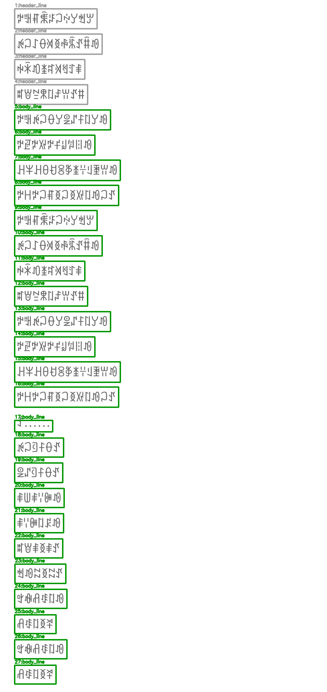
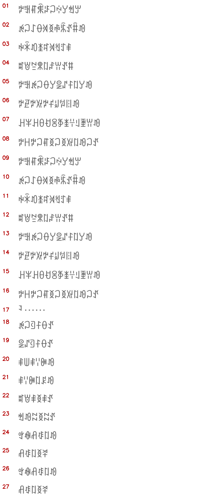

# 端到端示例：屏幕页

这个示例使用一张带人工 GT 的屏幕页，展示完整链路：

```text
屏幕页图片
-> crop_pipeline/run.py 切图
-> crop_pipeline/infer_line_crops.py 识别行图
-> postprocess/merge_line_ocr_results.py 合并页面文本
-> postprocess/add_nuosu_pronunciation.py 添加注音
```

## 样例图

这是一张真实屏幕页截图，带人工 GT，用来展示从整页图到可校对文本的完整流程。


人工 GT：[`screen_page_gt.txt`](screen_page_gt.txt)

## 切图结果预览

下面两张图是直接用本目录样例图跑 `crop_pipeline/run.py` 得到的结果，不是示意图。

检测框预览：



切好的行图拼接预览：



这次切图生成了 `27` 个汇总文件，`27` 个全部进入 `01_line_ocr_ready/`，校验结果为 `ok: true`。

可查看文件：

- 切图索引：[`preview/crop_index.csv`](preview/crop_index.csv)
- 切图校验：[`preview/crop_pipeline_validation.json`](preview/crop_pipeline_validation.json)

## 合并与注音结果预览

为了展示“多行结果合并为一段”的效果，这里用人工 GT 模拟逐行 OCR 全对时的 `line_ocr_result.jsonl`：

- 逐行 GT 模拟 OCR 结果：[`preview/line_gt_result_sample.jsonl`](preview/line_gt_result_sample.jsonl)
- 合并成一段后的 JSONL：[`preview/merged_gt_one_paragraph.jsonl`](preview/merged_gt_one_paragraph.jsonl)
- 合并成一段后的 TXT：[`preview/merged_gt_text/screen_page_with_gt_p001.txt`](preview/merged_gt_text/screen_page_with_gt_p001.txt)
- 加注音后的 JSONL：[`preview/merged_gt_pronounced.jsonl`](preview/merged_gt_pronounced.jsonl)
- 加注音后的 TXT：[`preview/merged_gt_text/screen_page_with_gt_p001_pronounced.txt`](preview/merged_gt_text/screen_page_with_gt_p001_pronounced.txt)

实际使用时，`line_gt_result_sample.jsonl` 这一步会替换成模型产生的 `line_ocr_result.jsonl`。

## 1. 切图

```bash
mkdir -p outputs/screen_page_input
cp crop_pipeline/examples/screen_page/screen_page_with_gt.jpg outputs/screen_page_input/

python3 crop_pipeline/run.py \
  --input outputs/screen_page_input \
  --output-root outputs/screen_page_crop
```

先看切图是否合理：

```text
outputs/screen_page_crop/03_cut_before_after_review/
```

可进入 OCR 的行图在：

```text
outputs/screen_page_crop/04_successful_crop_summary/01_line_ocr_ready/
```

## 2. 识别切行图

```bash
python crop_pipeline/infer_line_crops.py \
  --model models/NuosuBburma-OCR \
  --index outputs/screen_page_crop/04_successful_crop_summary/index.csv \
  --summary-root outputs/screen_page_crop/04_successful_crop_summary \
  --output outputs/screen_page_crop/line_ocr_result.jsonl
```

## 3. 合并回一段页面文本

```bash
python postprocess/merge_line_ocr_results.py \
  --results outputs/screen_page_crop/line_ocr_result.jsonl \
  --index outputs/screen_page_crop/04_successful_crop_summary/index.csv \
  --out-jsonl outputs/screen_page_crop/page_ocr_merged.jsonl \
  --out-txt-dir outputs/screen_page_crop/page_text \
  --separator ""
```

如果想保留原切行换行，可以去掉 `--separator ""`。

## 4. 添加注音

```bash
python postprocess/add_nuosu_pronunciation.py \
  --input outputs/screen_page_crop/page_ocr_merged.jsonl \
  --field text \
  --output outputs/screen_page_crop/page_ocr_merged_pronounced.jsonl
```
