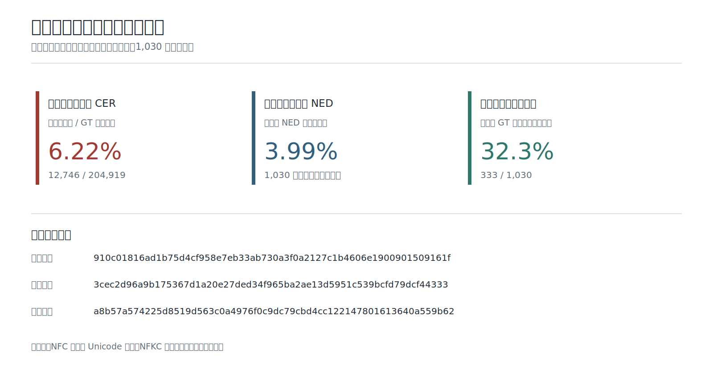
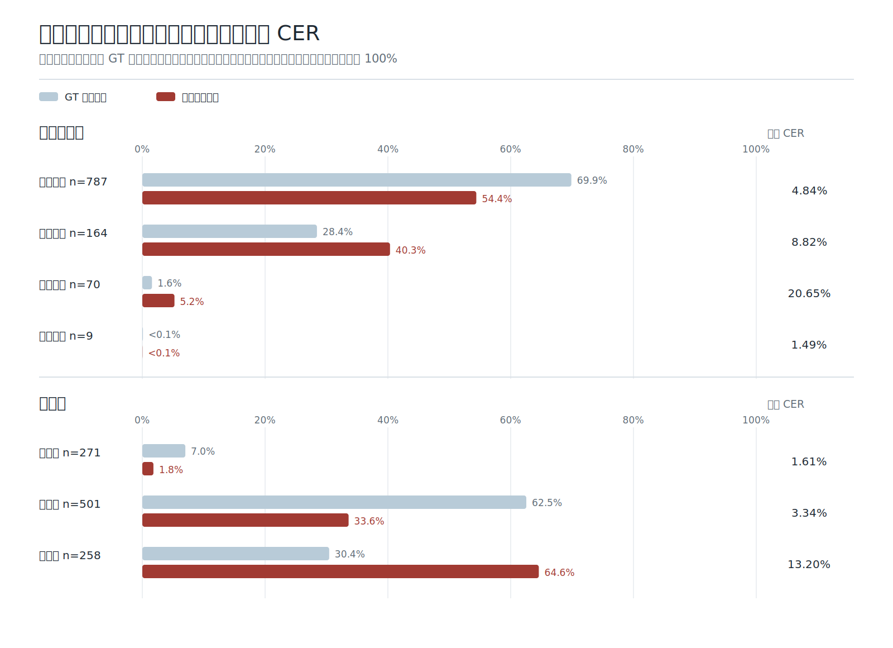
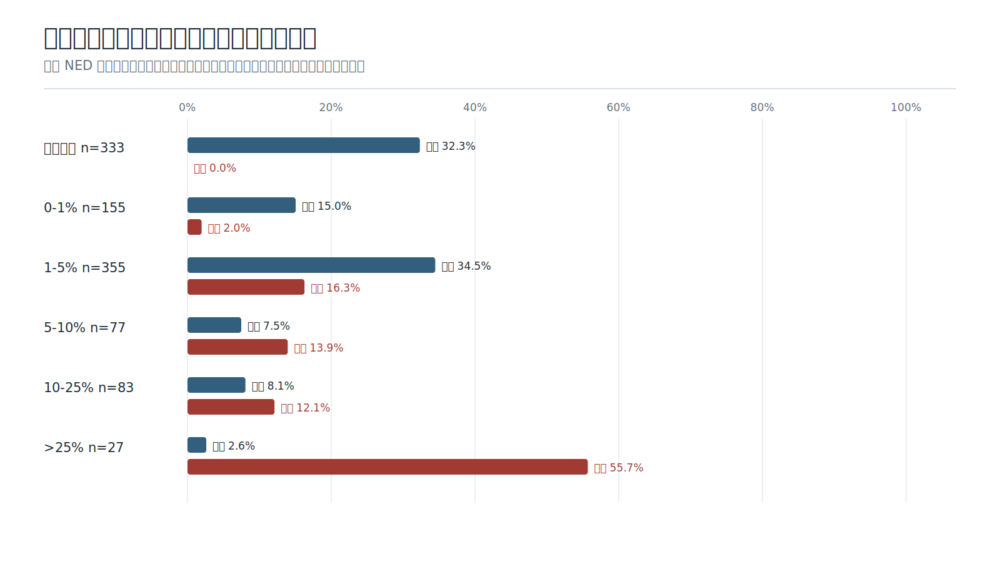

# 最终发布模型评估分析

## 评估对象与证据链

本报告只对应 Hugging Face 最终发布权重和完整 1,030 张真实评估图片，不混入训练中间模型或挑选后的子集。

- 最终模型权重 SHA-256：`910c01816ad1b75d4cf958e7eb33ab730a3f0a2127c1b4606e1900901509161f`
- 最终标注 SHA-256：`3cec2d96a9b175367d1a20e27ded34f965ba2ae13d5951c539bcfd79dcf44333`
- 固定预测 SHA-256：`a8b57a574225d8519d563c0a4976f0c9dc79cbd4cc122147801613640a559b62`
- 对齐结果：1,030 个唯一图片 SHA-256 全部一一匹配，无缺失、无重复。

预测文件在最后 7 条人工 GT 修订前已经固定；修订只更正经原图核实的标注，不更改模型、推理参数或预测文本。修订后使用当前标注哈希重算全部指标。

## 评分口径

主指标统一使用 NFC 规范化并删除全部 Unicode 空白后的语料级字符错误率：

```text
CER = 所有样本的 Levenshtein 编辑距离之和 / 所有 GT 字符数之和
    = 12,746 / 204,919
    = 6.22%
```

同时报告两个回答不同问题的辅助指标：逐样本 NED 先对每张图计算 `编辑距离 / max(预测长度, GT 长度)` 再等权平均，结果为 `3.99%`；规范化后完全一致为 333 / 1,030，即 `32.3%`。



CER 按字符加权，适合表达整个语料的总体识别错误；平均 NED 让长页和短区域各占一票，适合观察样本难度分布；完全一致率是最严格的整样本指标。三个指标不能相互换算，也不应混成一个排名。

Raw 平均 NED 为 `4.74%`，NFKC + 去空白平均 NED 为 `3.46%`，只用于分离排版空白和 Unicode 表示差异。NFKC 会将 `①` 等兼容字符折叠为其他字符，因此不作为主成绩。

## 误差贡献

只看分类均值会忽略各组长度和样本量差异。下面同时展示每组的 GT 字符占比、该组对全部编辑错误的贡献，以及组内 CER；同一种分组内的错误贡献之和严格等于 100%。



高难度样本包含 30.4% 的 GT 字符，却贡献 64.6% 的编辑错误，组内 CER 为 13.20%。屏幕拍摄包含 28.4% 的字符、贡献 40.3% 的错误，组内 CER 为 8.82%。手写拍照虽然只占 1.6% 的字符，但组内 CER 达 20.65%，说明它是能力短板，但并不是总体错误数量的最大来源。

书籍扫描贡献 54.4% 的错误，主要因为它覆盖了 69.9% 的 GT 字符；其组内 CER 为 4.84%，仍是主要场景中最稳定的一类。实景拍照只有 9 张，统计量过小，只作参考，不能外推一般实景能力。

## 长尾分布

均值无法说明错误是否均匀分布。按每张图片的 NED 划分互斥区间后，可以同时检查样本占比和编辑错误贡献。



333 张图片完全一致；另有 510 张图片的 NED 不超过 5%，两者合计占 81.8%。另一方面，只有 27 张图片的 NED 高于 25%，却贡献 55.7% 的编辑错误。当前总体结果主要被少数复杂封面、重复纹理、部首表格、屏幕摩尔纹和输出截断样本拉高，而不是所有图片都处于相同误差水平。

明确出现替换字符或长度上限截断的 5 张样本为：

- `le_e_ma_mu_guide_cover_page_000001`
- `yi_dictionary_radical_pdf_p087`
- `le_e_ma_mu_pdf_p096_region_04`
- `le_e_ma_mu_screen_photo_p025`
- `le_e_ma_mu_screen_photo_p022`

这些样本仍保留在完整评估中，没有因异常而删除。它们用于解释长尾和确定后续优化方向，不用于回改训练数据或选择当前模型。

## 复算

机器可读汇总见 [evaluation_metrics.json](evaluation_metrics.json)。[build_evaluation_figures.py](../scripts/build_evaluation_figures.py) 使用当前评估标注、固定预测和最终模型权重哈希重新计算指标并生成本页三张 SVG；仅从汇总 JSON 重新绘图时不需要原始 GT 或预测文件。

评估图片、GT、预测、错误类型和统计不进入训练或开发数据，也不用于检查点选择。评估集的构成、标注流程与质量审计见 [评估集说明](EVALUATION_DATASET.md)。
