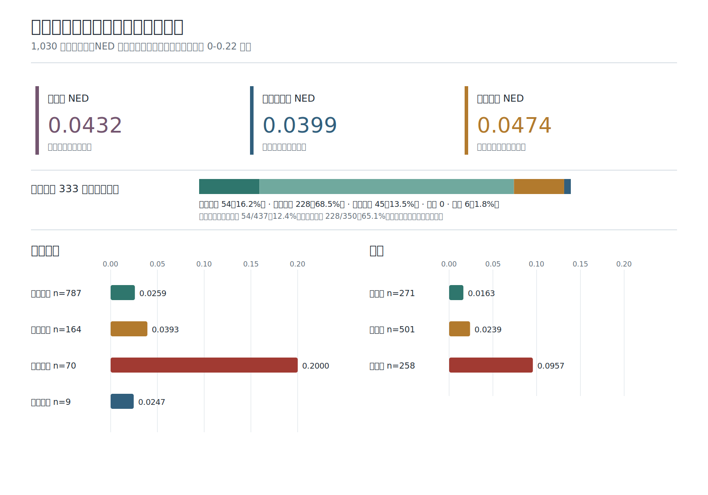

# 最终发布模型评估分析

## 评估对象

本报告只对应 Hugging Face 最终发布权重和完整 1,030 张真实评估图片，不混入训练中间模型或挑选后的子集。

- 最终模型权重 SHA-256：`910c01816ad1b75d4cf958e7eb33ab730a3f0a2127c1b4606e1900901509161f`
- 最终标注 SHA-256：`3cec2d96a9b175367d1a20e27ded34f965ba2ae13d5951c539bcfd79dcf44333`
- 固定预测 SHA-256：`a8b57a574225d8519d563c0a4976f0c9dc79cbd4cc122147801613640a559b62`
- 对齐结果：1,030 个唯一图片 SHA-256 全部一一匹配，无缺失、无重复。

预测文件在最后 7 条人工 GT 修订前已经固定；修订只更正经原图核实的标注，不更改模型、推理参数或预测文本。修订后使用当前标注哈希重算全部指标。

## NED 计算

每张图片先独立计算字符级 Levenshtein 编辑距离。一次替换、删除或插入都记为一次编辑：

```text
单张图片 NED = 编辑距离(预测, GT) / max(预测字符数, GT 字符数)
分组平均 NED = 组内所有图片 NED 之和 / 组内图片数
```

因此每张图片等权，不按页面文字长度加权。NED 为 `0` 表示完全正确，数值越低越好。

总彝文 NED 先从预测和 GT 中只保留 Unicode 规范彝文字符，再使用同一公式逐张计算并平均。

## 总体、场景与难度



总体结果与答辩 HTML 使用同一口径：

- 总彝文 NED：`0.0432`。
- 去空白平均 NED：`0.0399`，忽略空格和换行差异。
- 原始平均 NED：`0.0474`，保留模型原始输出格式。
- 彝汉混排 NED：`0.0249`，共 742 张。

按采集场景看，书籍扫描 NED 为 `0.0259`，是主要输入来源中最稳定的一类；屏幕拍摄为 `0.0393`；手写拍照为 `0.2000`，是最明确的短板。实景拍照为 `0.0247`，但只有 9 张，不能外推一般实景能力。

按难度看，低难度 NED 为 `0.0163`，中难度为 `0.0239`，高难度为 `0.0957`。高难度结果明显更差，主要反映复杂版式、封面图案、拍摄透视、摩尔纹、阴影和手写变化。

规范化后完全正确的 333 张按场景和样本粒度进一步拆分：书籍整页 54 张、书籍区域 228 张、屏幕拍摄 45 张、手写拍照 0 张、实景拍照 6 张。书籍整页完全正确率为 54 / 437（`12.4%`），书籍区域为 228 / 350（`65.1%`）；这说明“书籍扫描 282 张完全正确”主要来自区域样本，不能直接解释为整页能力。

## 异常输出


5 张明确异常输出占全部样本的 `0.5%`，贡献约 `8.6%` 的总逐样本 NED。它们仍保留在完整评估中，没有因异常而删除：

- `le_e_ma_mu_guide_cover_page_000001`
- `yi_dictionary_radical_pdf_p087`
- `le_e_ma_mu_pdf_p096_region_04`
- `le_e_ma_mu_screen_photo_p025`
- `le_e_ma_mu_screen_photo_p022`

异常主要由封面图案、重复字形表格、屏幕摩尔纹和输出达到长度上限触发。它们用于说明模型不足，不用于回改训练数据或选择当前模型。

## 补充指标

规范化后完全一致为 333 / 1,030，即 `32.3%`。语料级 CER 为 `6.22%`，计算方式是全部编辑距离之和除以全部 GT 字符数；它会让长页面占更大权重，因此只作为补充，不替代答辩材料中的逐样本平均 NED。NFKC + 去空白平均 NED 为 `0.0346`，也只用于 Unicode 表示差异诊断。

机器可读汇总见 [evaluation_metrics.json](evaluation_metrics.json)。[build_evaluation_figures.py](../scripts/build_evaluation_figures.py) 使用当前评估标注、固定预测和最终模型权重哈希重新计算指标并生成 SVG。评估集构成、标注流程与质量审计见 [评估集说明](EVALUATION_DATASET.md)。
