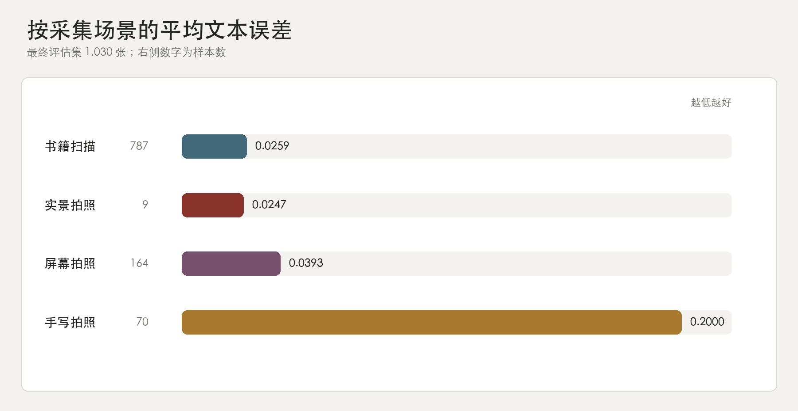
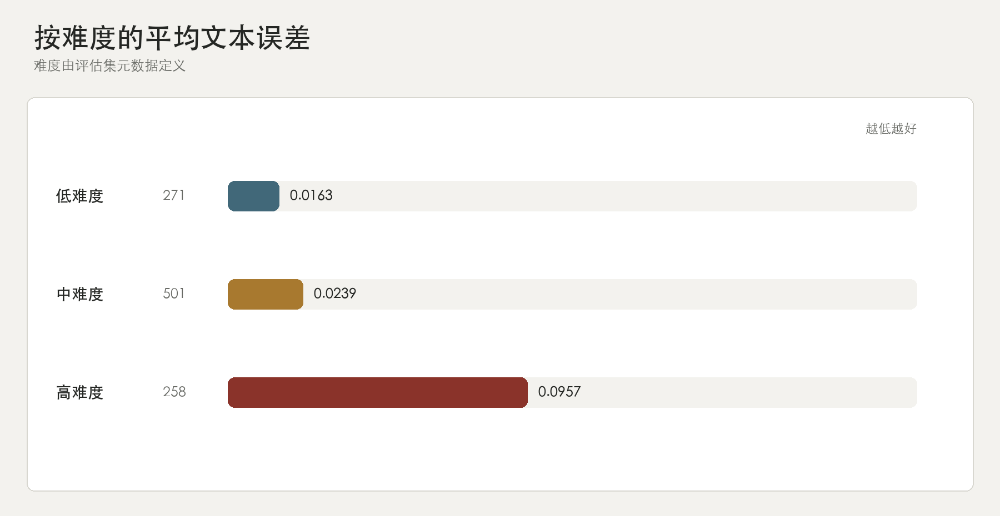
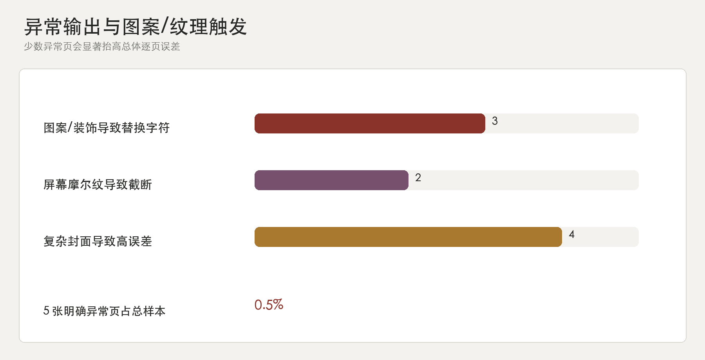

# NuosuBburma OCR 分类评估分析

## 说明

本报告对应最终 1,030 张真实评估图片和当前标准答案。下面只使用一套逐页平均文本误差（NED），数值越低越好。计算时忽略换行和空格造成的排版差异，重点观察模型是否把可见文字读对。

分组按采集场景和难度统计整样本 NED。

## 采集场景

图中同时标出每类样本数和平均文本误差（NED）。

手写拍照是第一短板，误差约为书籍扫描的 7.7 倍。屏幕拍照是第二个需要单独优化的场景，摩尔纹、反光、透视和拍摄缩放会同时影响字符边界和阅读顺序。实景拍照只有 9 张，当前结果只能作为小规模参考，不能外推到一般实景文字。

## 难度

图中同时标出每类样本数和平均文本误差（NED）。

高难度误差约为低难度的 5.9 倍。高难度集合包含封面和拍摄类样本，因此差距主要反映真实视觉干扰、复杂版式和拍摄质量，而不是简单的文字表覆盖问题。

## 异常输出页

这一部分的目的，是解释总体 NED 为什么被拉高，而不是只罗列错误页面：少数带有明显图案、花纹或重复纹理的页面，会触发异常生成，误差因此集中在这些页面上，而不是平均地分布在整个评估集。

明确需要单独标记的异常输出共 5 张。这 5 张只占全部样本的 `0.5%`，却贡献约 `8.6%` 的总逐页误差；如果单独拿掉这 5 张，整体平均误差会从约 `0.03990` 降到约 `0.03664`。这个对照不是为了删除异常页，而是为了说明总体数字被少数图案和纹理触发的异常生成明显抬高。

从图像看，异常触发主要来自三种视觉条件：封面上的装饰图案和嵌入图片、部首检字页的重复字形表格、屏幕拍摄产生的摩尔纹与密集重复行。它们更像输入形态触发的生成失控，而不是普通单字的局部混淆。

5 张明确异常页如下：

- `le_e_ma_mu_guide_cover_page_000001`：几乎全页为 `�`，输出撞到长度上限。
- `yi_dictionary_radical_pdf_p087`：几乎全页为 `�`，输出撞到长度上限。
- `le_e_ma_mu_pdf_p096_region_04`：几乎全页为 `�`，输出撞到长度上限。
- `le_e_ma_mu_screen_photo_p025`：出现 `�`，且输出被长度上限截断。
- `le_e_ma_mu_screen_photo_p022`：没有大面积 `�`，但输出被长度上限截断，内容不完整。

| 触发条件 | 明确异常页 | 典型表现 |
|---|---:|---|
| 封面图案、装饰和重复字形纹理 | 3 | 大量替换字符，或输出持续重复并撞到长度上限 |
| 屏幕摩尔纹和密集重复行 | 2 | 行结构混乱，输出被截断或内容不完整 |

这张表解释的是异常生成的触发来源；另外 4 张高误差但没有明显乱码的页面，属于复杂封面或版式干扰，单独列入人工复核，不计入上面的 5 张明确异常页。

另外，以下页面属于高误差但没有明显乱码的页面，应进入人工复核清单：

- `luoe_teyi_cover_page_000001`
- `college_yi_language_cover_page_000001`
- `sichuan_yi_clan_papers_cover_page_000001`
- `xuezu_page_001`

## 结论

当前模型在清晰书籍扫描和普通文档上最稳定；手写拍照、屏幕拍照，以及少数图案、纹理或摩尔纹页面误差更高，是后续优化的主要方向。
