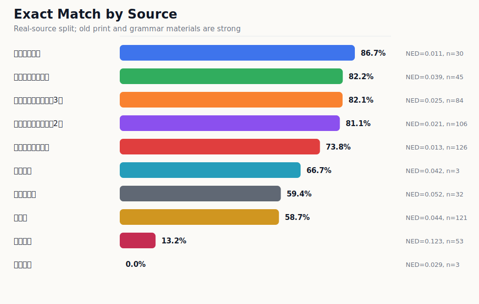

# NuosuBburma OCR Evaluation Results

本目录保存提交模型在 `NuosuBburma OCR Evaluation Set` 上的重跑结果。

评估集共 `603` 条真实来源样本，合成样本不进入主评估。这里保留的是公开展示和复查需要的最小结果包：指标摘要、分组统计、图表和一份逐条模型输出。

## 核心结论

| 指标 | 结果 | 解读 |
|---|---:|---|
| Avg NED | `0.036068` | 整体编辑距离较低 |
| Exact match | `67.99%` | 严格逐字完全匹配 |
| WS Avg NED | `0.034219` | 忽略空白差异后略有提升 |
| Yi-only exact | `74.96%` | 彝文主体识别较稳定 |
| Han-only exact | `93.99%` | 彝汉混排中的汉字保持较好 |
| Digit-only exact | `85.19%` | 数字可用，但仍弱于汉字 |
| replacement collapse | `0` | 未出现替换符崩溃 |
| long prediction failure | `0` | 未出现超长输出失控 |
| LaTeX-like outputs | `2` | 仍有少量脚注/符号公式化残留 |

## 指标怎么读

| 英文指标 | 中文解释 | 怎么判断好坏 |
|---|---|---|
| Avg NED | 平均归一化编辑距离。预测文本改成 GT 需要多少编辑量，再按文本长度归一 | 越低越好，`0` 表示完全一致 |
| Exact match | 完全匹配率。一条样本的预测和 GT 完全一致才算正确 | 越高越好；标点、空格、换行差异也会影响 |
| WS Avg NED | 忽略空白差异后的 Avg NED | 用来看模型是不是主要输在空格/换行格式 |
| NFKC+WS Avg NED | 做 Unicode 兼容规范化并忽略空白差异后的 Avg NED | 用来看全半角、兼容字符和空白格式影响 |
| Yi-only exact | 只抽取彝文字符后计算完全匹配率 | 反映彝文字本体识别能力 |
| Han-only exact | 只抽取汉字后计算完全匹配率 | 反映彝汉混排里的汉字稳定性 |
| Digit-only exact | 只抽取数字后计算完全匹配率 | 反映页码、编号、数字串稳定性 |
| replacement collapse | 是否输出大量 `�` 替换符 | 越少越好，`0` 表示没有这类崩溃 |
| LaTeX-like outputs | 是否把脚注、圈号或符号输出成公式样文本 | 越少越好，本次为 `2` 条 |
| ASCII-letter | 是否输出拉丁字母 | 用于监控 Latin/拼音尾巴风险，需要结合样本 GT 判断 |
| long prediction failure | 是否出现异常超长输出 | 越少越好，`0` 表示没有长输出失控 |

## 结果图表

### 总体能力


### 不同输入粒度


结论：`line` 输入最稳定，`region/page` 更容易暴露漏行、边界和版式问题。这个结果符合真实 OCR 使用经验：行图识别和整页/区域识别不是同一难度。

### 不同真实场景


结论：新旧印刷体表现稳定，手写仍是最弱场景；屏幕/真实场景样本量较小，只作为补充观察。

### 不同来源



结论：旧印刷资料选译、语法书和《勒俄特依》译注等来源表现较强；真实手写明显更难，应单独解释。

### 输出安全性


结论：此前最危险的替换符崩溃和超长输出没有出现；LaTeX-like 残留为 `2` 条，是后续可继续修的小风险。

## 文件结构

```text
summary.md
summary.json
charts/
  accuracy_overview.svg
  exact_by_sample_type.svg
  exact_by_source.svg
  ned_by_scene.svg
  safety_failures.svg
tables/
  by_difficulty.csv
  by_has_digit.csv
  by_sample_type.csv
  by_scene.csv
  by_script_mix.csv
  by_source.csv
raw/
  submission_model_result.jsonl
```

## 复查说明

- `summary.md` / `summary.json`：主指标摘要。
- `charts/`：面向评审和读者的图表化结果。
- `tables/`：按来源、场景、难度、输入粒度等维度拆分的统计表。
- `raw/submission_model_result.jsonl`：模型逐条输出结果，用于证明评估不是只手写了汇总表。

本目录不保留训练日志、评估运行日志、人工审查中间表和全量错误工作表，避免公开仓库变成实验过程垃圾堆。复现脚本见 [`../../scripts/`](../../scripts/)。
