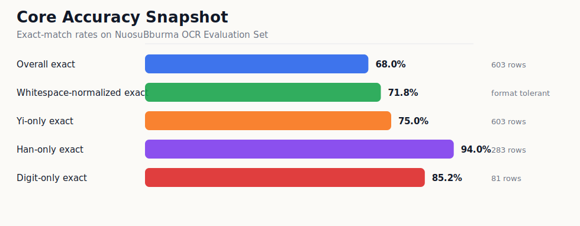
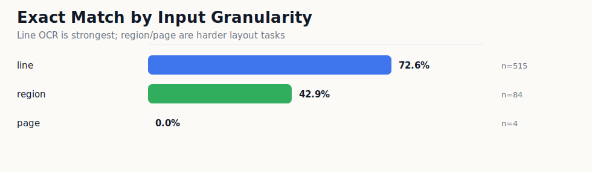

# 评估结果

本目录存放 `NuosuBburma OCR` 在提交评估集上的公开评估结果。

详细结果看板见 [NuosuBburma OCR Evaluation Set](NuosuBburma_OCR_Evaluation_Set/README.md)。

主结果：

| 指标 | 值 |
|---|---:|
| Samples | 603 |
| Avg NED | 0.036068 |
| Exact match | 67.99% |
| Yi-only exact | 74.96% |
| Han-only exact | 93.99% |
| replacement / LaTeX / long_pred | 0 / 2 / 0 |

## 图表化结果

### 总体识别能力



### 按输入粒度拆分



### 按真实场景拆分


### 输出安全性


## 指标怎么读

| 英文指标 | 中文解释 | 怎么判断好坏 |
|---|---|---|
| Samples | 样本数。本次提交评估集共 603 条真实样本 | 只说明规模，不是准确率 |
| Avg NED | 平均归一化编辑距离。预测文本改成 GT 需要多少编辑量，再按长度归一 | 越低越好，`0` 表示完全一致 |
| Exact match | 完全匹配率。一条样本的预测和 GT 完全一致才算正确 | 越高越好；标点、空格、换行差异也会影响 |
| WS Avg NED | 忽略空白差异后的 Avg NED | 用来看模型是不是主要输在空格/换行格式 |
| NFKC+WS Avg NED | 先做 Unicode 兼容规范化，再忽略空白差异后的 Avg NED | 用来看全半角、兼容字符和空白格式影响 |
| Yi-only exact | 只抽取彝文字符后计算完全匹配率 | 反映彝文字本体识别能力 |
| Han-only exact | 只抽取汉字后计算完全匹配率 | 反映彝汉混排里的汉字稳定性 |
| Digit-only exact | 只抽取数字后计算完全匹配率 | 反映页码、编号、数字串稳定性 |
| replacement collapse | 是否输出大量 `�` 替换符 | 越少越好，`0` 表示没有这类崩溃 |
| LaTeX-like outputs | 是否把脚注/符号输出成公式样文本 | 越少越好，本次为 2 条 |
| ASCII-letter | 是否输出拉丁字母 | 用于监控 Latin/拼音尾巴风险，需要结合样本 GT 判断 |
| long_pred | 是否出现异常超长输出 | 越少越好，`0` 表示没有长输出失控 |

公开结果包只保留摘要、图表、分组统计和逐条模型输出。训练日志、运行日志和人工审查中间表不放入公开目录。

重新生成统计：

```bash
python scripts/analyze_submission_eval.py \
  --annotations datasets/NuosuBburma_OCR_Evaluation_Set/annotations.jsonl \
  --result evaluation/NuosuBburma_OCR_Evaluation_Set/raw/submission_model_result.jsonl \
  --out-dir outputs/NuosuBburma_OCR_Evaluation_Set/analysis
```
