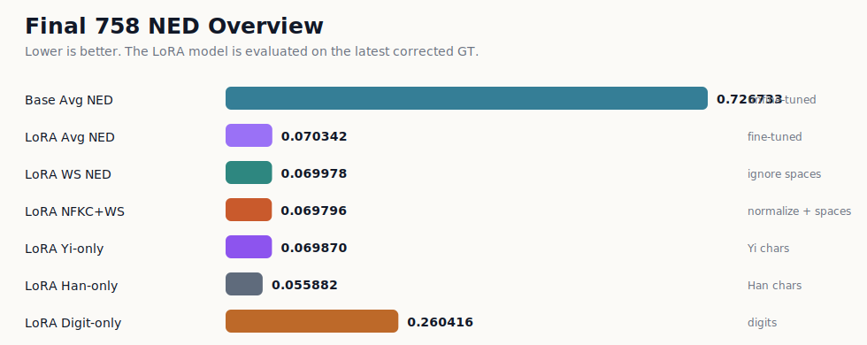
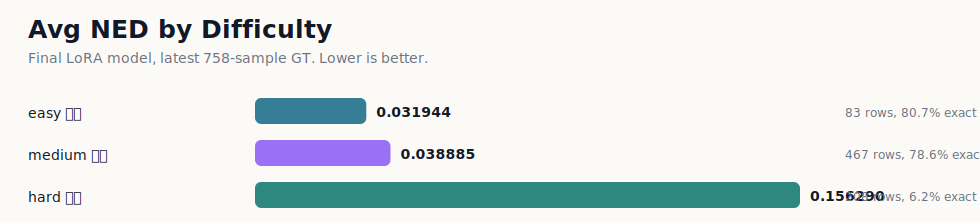
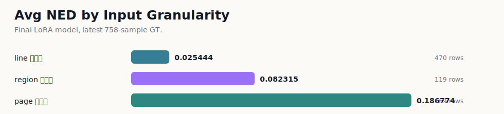
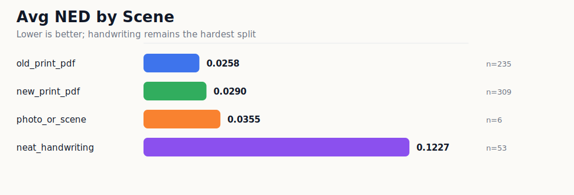

# 最终评估结果

本目录作为公开评估结果入口。当前统一口径为最终 `758` 条真实来源样本，使用最新人工 GT；`real_screen_photo_nonbook_004`、`real_screen_photo_nonbook_005` 和 `xuezu_page_001` 的 GT 修正已合并。

## 当前结果

归一化编辑距离（NED）越低越好。LoRA 微调后整体 Avg NED 为 `0.070123`，未微调基座为 `0.726733`。

| 指标 | 未微调基座 | LoRA 微调后 |
|---|---:|---:|
| 评估样本 | `758` | `758` |
| Avg NED | `0.726733` | `0.070123` |
| WS Avg NED | `0.719600` | `0.069809` |
| NFKC+WS Avg NED | `0.706794` | `0.069627` |
| Exact | `0 / 758` | `447 / 758 (59.0%)` |
| Yi-only Avg NED | `1.000000` | `0.069797` |
| Han-only Avg NED | `0.209245` | `0.055544` |
| Digit-only Avg NED | `0.369451` | `0.260416` |
| replacement / LaTeX-like / extra Latin / long prediction | `16 / 105 / 321 / 34` | `0 / 6 / 1 / 1` |

## 多角度统计

| 公开主维度 | 入口 |
|---|---|
| 难度 简单 / 复杂 / 困难 | `tables/by_difficulty.csv` |
| 输入粒度 line / region / page | `tables/by_sample_type.csv` |
| 真实场景 old_print / new_print / screen / handwriting / photo | `tables/by_scene.csv` |
| 风险输出样本 | `tables/risk_rows.csv` |
| 最差 50 条 | `tables/worst_50.csv` |

其他诊断和追溯表保留在 `tables/` 中，不作为公开主图展示。

## 核心拆分

### 按难度

| 分组 | rows | Avg NED | WS NED | Exact | Yi-only NED | Han-only NED | Digit-only NED | 风险 |
|---|---:|---:|---:|---:|---:|---:|---:|---:|
| easy 简单 | 83 | 0.031944 | 0.030882 | 67/83 (80.7%) | 0.029882 |  | 0.200000 | 0/0/0/0 |
| medium 复杂 | 467 | 0.038885 | 0.037800 | 367/467 (78.6%) | 0.042977 | 0.021321 | 0.111111 | 0/1/0/0 |
| hard 困难 | 208 | 0.155494 | 0.157208 | 13/208 (6.2%) | 0.146308 | 0.117706 | 0.316220 | 0/5/1/1 |

### 按输入粒度

| 分组 | rows | Avg NED | WS NED | Exact | Yi-only NED | Han-only NED | Digit-only NED | 风险 |
|---|---:|---:|---:|---:|---:|---:|---:|---:|
| line 单行图 | 470 | 0.025444 | 0.024531 | 386/470 (82.1%) | 0.029608 | 0.012273 | 0.151515 | 0/1/0/0 |
| region 区域图 | 119 | 0.082315 | 0.084714 | 57/119 (47.9%) | 0.077560 | 0.085192 | 0.200000 | 0/0/0/0 |
| page 整页图 | 169 | 0.185795 | 0.185234 | 4/169 (2.4%) | 0.176731 | 0.112077 | 0.310749 | 0/5/1/1 |

### 按真实场景

| 分组 | rows | Avg NED | WS NED | Exact | Yi-only NED | Han-only NED | Digit-only NED | 风险 |
|---|---:|---:|---:|---:|---:|---:|---:|---:|
| 旧印刷/扫描资料 | 507 | 0.036547 | 0.036220 | 356/507 (70.2%) | 0.039600 | 0.026235 | 0.335681 | 0/1/1/0 |
| 新印刷/PDF | 100 | 0.053856 | 0.050283 | 71/100 (71.0%) | 0.062095 | 0.023500 | 0.085106 | 0/0/0/0 |
| 屏幕拍照/页面上传图 | 87 | 0.258809 | 0.257171 | 3/87 (3.4%) | 0.213667 | 0.172971 | 0.292430 | 0/5/0/1 |
| 手写拍照 | 53 | 0.124483 | 0.132436 | 7/53 (13.2%) | 0.147964 | 1.000000 | 1.000000 | 0/0/0/0 |
| 真实场景照片 | 11 | 0.011364 | 0.011858 | 10/11 (90.9%) | 0.014354 | 0.000000 |  | 0/0/0/0 |

## 指标怎么读

| 指标 | 中文解释 |
|---|---|
| Avg NED | 平均归一化编辑距离。预测文本改成人工标注需要多少编辑量，再按文本长度归一 |
| WS Avg NED | 忽略空白差异后的 Avg NED |
| NFKC+WS Avg NED | 做 Unicode 兼容规范化并忽略空白差异后的 Avg NED |
| Yi-only / Han-only / Digit-only Avg NED | 分别只抽取彝文、汉字、数字后计算 NED |
| replacement / LaTeX-like / extra Latin / long prediction | 输出风险检查项 |

## 结果图表

### 总体 NED



### 不同难度



### 不同输入粒度



### 不同真实场景



### 输出风险


## 文件结构

```text
summary.md
summary.json
raw/
  submission_model_result.jsonl
  submission_model_predictions.jsonl
tables/
  by_difficulty.csv
  by_sample_type.csv
  by_scene.csv
  by_script_mix.csv
  by_has_digit.csv
  by_text_length.csv
  by_gt_lines.csv
  all_scored_rows.csv
  worst_50.csv
  risk_rows.csv
charts/
  ned_overview.svg
  ned_by_difficulty.svg
  ned_by_sample_type.svg
  ned_by_scene.svg
  safety_failures.svg
```
