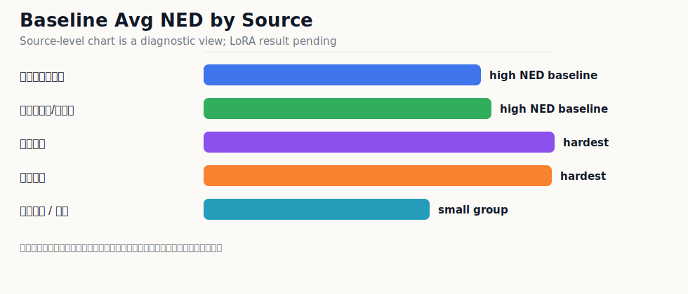

# 开发诊断结果

本目录保存 `规范彝文 OCR / NuosuBburma OCR` 的开发诊断结果、分组统计和逐条输出样例。它的作用是解释模型分支选择和错误风险，不替代最终提交评估表。

最终提交评估表使用同一 `NuosuBburma OCR Evaluation Set`、同一脚本和同一指标。当前提交模型已经完成 `603` 条主评估样本统计。

PaddleOCR-VL Base、第一阶段、第二阶段和最终模型结果将在最终评估集冻结后按同一脚本补充。

复杂整页切割/版面对比压力测试材料不放在本 OCR 模型包的 `evaluation/` 中；本目录只保留主评估集相关的模型输出、图表和分组统计。

## 核心结论

| 指标 | 结果 | 解读 |
|---|---:|---|
| Avg NED | `0.036068` | 整体编辑距离较低 |
| WS Avg NED | `0.034219` | 忽略空白差异后略有提升 |
| NFKC+WS Avg NED | `0.033964` | 兼容字符和空白规范化后进一步降低 |
| Yi-only Avg NED | `0.038309` | 彝文主体识别较稳定 |
| Han-only Avg NED | `0.022447` | 彝汉混排中的汉字稳定性较高 |
| Digit-only Avg NED | `0.139918` | 数字仍弱于正文文字 |
| replacement collapse | `0` | 未出现替换符崩溃 |
| long prediction failure | `0` | 未出现超长输出失控 |
| LaTeX-like outputs | `2` | 有 `2` 条脚注/符号公式化输出需要单独复查 |

## 指标怎么读

| 英文指标 | 中文解释 | 怎么判断好坏 |
|---|---|---|
| Avg NED | 平均归一化编辑距离。预测文本改成人工标注需要多少编辑量，再按文本长度归一 | 越低越好，`0` 表示完全一致 |
| WS Avg NED | 忽略空白差异后的 Avg NED | 用来看模型是不是主要输在空格/换行格式 |
| NFKC+WS Avg NED | 做 Unicode 兼容规范化并忽略空白差异后的 Avg NED | 用来看全半角、兼容字符和空白格式影响 |
| Yi-only Avg NED | 只抽取彝文字符后计算 NED | 反映彝文字本体识别能力 |
| Han-only Avg NED | 只抽取汉字后计算 NED | 反映彝汉混排里的汉字稳定性 |
| Digit-only Avg NED | 只抽取数字后计算 NED | 反映页码、编号、数字串稳定性 |
| replacement collapse | 是否输出大量 `�` 替换符 | 越少越好，`0` 表示没有这类崩溃 |
| LaTeX-like outputs | 是否把脚注、圈号或符号输出成公式样文本 | 越少越好，本次为 `2` 条 |
| ASCII-letter | 预测是否输出拉丁字母 | 本次为 `18` 条；这 18 条人工标注本身也都有 Latin 注音，不计作多余拉丁漂移 |
| extra Latin | 人工标注无 Latin 但预测多出 Latin | 越少越好，本次为 `0` 条 |
| long prediction failure | 是否出现异常超长输出 | 越少越好，`0` 表示没有长输出失控 |

## 结果图表

### 总体 NED


### 不同输入粒度


结论：`line` 输入最稳定，`region/page` 更容易暴露漏行、边界、阅读顺序和非标注换行问题。这个结果符合真实 OCR 使用经验：行图识别和整页/区域识别不是同一难度。

### 不同真实场景


结论：新旧印刷体表现稳定，规范手写和照片/真实场景作为独立分组观察，不与清晰印刷行图混算。

### 不同来源



结论：旧印刷资料选译、语法书和《勒俄特依》译注等来源表现较强；规范手写资料单独报告，避免掩盖不同来源的识别差异。

### 输出安全性


结论：此前最危险的替换符崩溃和超长输出没有出现；LaTeX-like 残留为 `2` 条，是后续可继续修的小风险。

## 文件结构

```text
summary.md
summary.json
charts/
  ned_overview.svg
  ned_by_sample_type.svg
  ned_by_source.svg
  ned_by_scene.svg
  safety_failures.svg
tables/
  by_difficulty.csv
  by_has_digit.csv
  by_sample_type.csv
  by_scene.csv
  by_script_mix.csv
  by_source.csv
raw/
  submission_model_result.jsonl
```

## 复查说明

- `summary.md` / `summary.json`：主指标摘要。
- `charts/`：面向评审和读者的图表化结果。
- `tables/`：按来源、场景、难度、输入粒度等维度拆分的统计表。
- `raw/submission_model_result.jsonl`：模型逐条输出结果，用于证明评估不是只提供汇总表。

本目录不保留训练日志、评估运行日志、人工审查中间表、复杂整页压力测试材料和全量错误工作表。复现脚本见 [`../scripts/`](../scripts/)。
